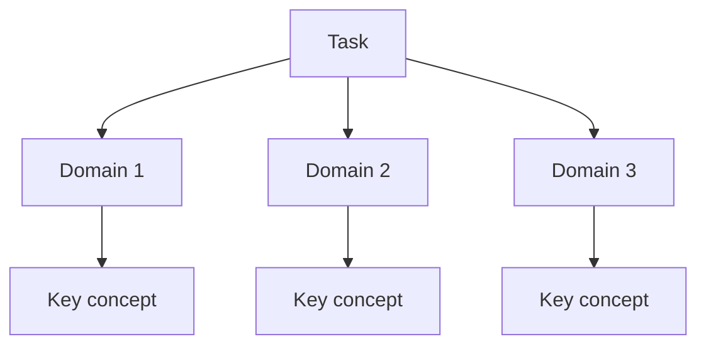

# CS Domain Learning Extraction Skill

This skill turns any implementation task into a deep learning opportunity. It maps the **entire computer science knowledge landscape** touched by the task, from high-level product behavior down to runtime, OS, network, database, browser, or infrastructure details.

This skill is **project-agnostic and stack-adaptive**. Use the current repository's actual language, framework, runtime, tools, files, and architecture. Do not copy examples from another project unless they truly match this codebase.

---

## Core Principles (Non-Negotiable)

1. **Every task touches multiple CS domains.** Even a simple UI form can involve state management, validation, HTTP, security, accessibility, browser rendering, and API contracts.
2. **Explain from first principles.** Do not only say a pattern is good. Explain why it exists, what resources it uses, what constraints shape it, and what breaks without it.
3. **Use the cognitive bridge.** Every major concept gets a physical analogy, constraint model, and mapping to code in this repository.
4. **Create visual concept maps.** Include Mermaid diagrams. If an image-generation tool is available, generate a visual mind map too. If not, state that limitation and use Mermaid.
5. **Reference the current codebase.** Concepts should link back to exact files, functions, routes, components, schemas, configs, or tests where they appear.
6. **Adapt depth to task size.** Small tasks may need fewer domains. Large architectural tasks need broader and deeper domain coverage.

---

## Required Document Structure

Save as `task_X_Y_cs_concepts.md` in the artifact directory.

### Section 1: Domain Discovery Map

Identify every CS domain the task touches.

Possible domains include:

- Frontend architecture
- Browser rendering and event loop
- State management
- Forms and validation
- HTTP and APIs
- Authentication and authorization
- Security and privacy
- Accessibility
- Backend routing and middleware
- Database modeling and transactions
- Caching
- Concurrency and async programming
- Networking and protocols
- Operating systems and processes
- Cloud/container infrastructure
- Testing strategy
- Build tooling and dependency management
- Language/runtime internals
- Observability and logging
- AI/ML concepts, if relevant

Include a Mermaid concept map:



Use real task/domain names in the final artifact.

### Section 2: Domain Deep Dives

For each important domain, create a subsection using this template.

#### Domain: [Domain Name]

**What Is It (Plain English):**

Explain in 3-5 beginner-friendly sentences.

**Physical Analogy:**

Map the concept to a real-world scenario.

Examples:

- Auth guard → Bouncer checking wristbands.
- Form validation → Receptionist checking an application before filing it.
- Query cache → A librarian keeping popular books at the front desk.
- Database transaction → All-or-nothing bank transfer.
- Event loop → A single clerk processing a queue of tickets.
- Rate limiting → Traffic lights controlling cars entering a bridge.
- Accessibility labels → Signs and tactile markers in a building.

**How It Works Under the Hood:**

Adapt to the domain:

- Frontend: browser event loop, DOM updates, rendering, hydration, focus management, network requests.
- Backend: request lifecycle, middleware/dependencies, validation, service/repository boundaries.
- Database: indexes, transactions, constraints, query plans, locks.
- Network: DNS, TCP/TLS, HTTP, status codes, CORS.
- Security: trust boundaries, token/session lifecycle, threat model, storage risks.
- Runtime/language: memory model, async scheduling, type system, module loading.
- Infrastructure: processes, containers, environment variables, logs, resource limits.

Use a table like:

```markdown
| Layer | What Happens | Resource/Constraint |
|-------|--------------|--------------------|
| User/Product | ... | ... |
| Application | ... | ... |
| Framework/Library | ... | ... |
| Runtime/Browser/Server | ... | ... |
| OS/Network/Infrastructure | ... | ... |
```

**Where It Manifests in This Codebase:**

Link to exact files and symbols:

```markdown
- `path/to/file.ext` — function/component/class/schema/config and why it matters.
- `path/to/test.ext` — test that protects the behavior.
```

Use clickable links where the environment supports them.

**Common Misconceptions:**

List 3-5 beginner mistakes.

```markdown
1. ❌ "..." → ✅ Reality: "..."
2. ❌ "..." → ✅ Reality: "..."
3. ❌ "..." → ✅ Reality: "..."
```

**The Numbers or Constraints That Matter:**

Provide concrete limits, metrics, rules, or tradeoffs when relevant:

```markdown
| Metric/Constraint | Typical Value or Rule | Why It Matters |
|-------------------|-----------------------|----------------|
| ... | ... | ... |
```

If exact values are unknown, say what should be measured.

---

### Section 3: Cross-Domain Connections

Show how concepts interact:

```markdown
| Concept A | Concept B | Connection |
|-----------|-----------|------------|
| UI state | API contract | UI depends on response shape and error status |
| Auth token | Browser storage | Storage choice affects XSS/session risk |
| DB constraint | Form validation | Frontend validation improves UX, DB still enforces truth |
| Async runtime | HTTP requests | Slow I/O must not block unrelated work |
```

Use actual concepts from the task.

### Section 4: Concept Evolution Timeline

Show how the user's mental model should evolve:

```markdown
| Level | What You Might Think | Deeper Reality |
|-------|----------------------|----------------|
| Beginner | ... | ... |
| Intermediate | ... | ... |
| Advanced | ... | ... |
| Expert | ... | ... |
```

### Section 5: Vocabulary Reference

Create a glossary of every important term:

```markdown
| Term | Definition | Codebase Example |
|------|------------|------------------|
| ... | ... | ... |
```

### Section 6: "What If" Scenarios

Include thought experiments that deepen understanding:

```markdown
**Q: What if the API returns 401?**
A: Explain what happens, how the UI should respond, and what code owns the behavior.

**Q: What if the user refreshes the page?**
A: Explain persisted state, refetching, token/session recovery, or failure mode.
```

Provide at least four scenarios for non-trivial tasks.

### Section 7: Further Reading

Link to authoritative resources relevant to the actual domains:

```markdown
| Topic | Resource | Type |
|-------|----------|------|
| HTTP semantics | MDN HTTP response status codes | Official/reference |
| Accessibility | WAI-ARIA Authoring Practices | Official/reference |
| Database transactions | Vendor documentation | Official docs |
| Framework concept | Framework docs | Official docs |
```

Prefer official documentation, standards, and reputable engineering references.

---

## Workflow Checklist

Before marking the CS Concepts document as complete, verify:

- [ ] Domain discovery map included.
- [ ] Mermaid concept map included.
- [ ] Image mind map included if image-generation tools are available, or limitation stated.
- [ ] Important domains have deep dives.
- [ ] Each deep dive has plain-English explanation, physical analogy, under-the-hood explanation, codebase references, misconceptions, and constraints/metrics.
- [ ] Cross-domain connection table filled in.
- [ ] Concept evolution timeline provided.
- [ ] Vocabulary reference included.
- [ ] At least 4 "What If" scenarios explored for non-trivial tasks.
- [ ] Further reading links provided.
- [ ] All examples are adapted to the current codebase.
