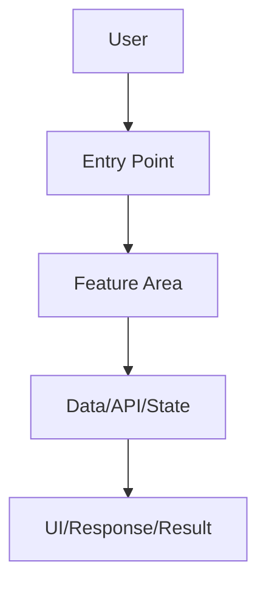
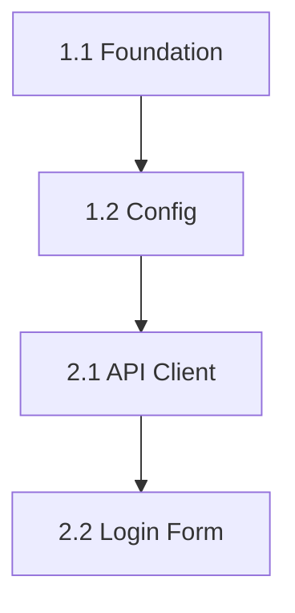

# Roadmap WBS Planner Skill

This is **Stage 0** of the generic task lifecycle. Use it before Stage 1 when the user has a broad idea, vague feature request, new project direction, or needs help deciding what to build next.

This skill turns an unclear idea into a structured, learnable, implementable roadmap. It behaves like a **senior product engineer + technical lead + learning mentor**.

This skill is **no-code**. It creates planning artifacts only.

---

## When to Use This Skill

Use this skill when the user asks for any of the following:

- Brainstorming features or implementation direction.
- Planning a frontend, backend, full-stack, DevOps, testing, refactor, or learning roadmap.
- Breaking a large idea into small tasks.
- Creating a WBS, backlog, roadmap, milestones, epics, or task cards.
- Deciding the MVP scope.
- Understanding what to do first, second, third.
- Preparing tasks that will later use `concept-to-code-bridge`, `codebase-design`, `implementation-planning`, and `testing-verification`.

Do **not** use this skill for tiny one-step fixes where the task is already clear.

---

## Core Principles (Non-Negotiable)

1. **Ask before planning when the goal is vague.** Do not invent a roadmap from thin air. Interview the user first unless the repository and request already provide enough context.

2. **Grill kindly, not aggressively.** Ask sharp product, learning, technical, and scope-control questions. The goal is clarity, not interrogation.

3. **Separate ideas from commitments.** Brainstorm broadly first, then explicitly mark what is Must / Should / Could / Won't for now.

4. **Break work to the lowest useful level.** Leaf tasks should be small enough for a learner to complete in roughly 30-90 minutes, teach one main concept, and have clear acceptance criteria.

5. **Every leaf task must be testable.** If a task cannot be verified, it is not broken down enough or its acceptance criteria are unclear.

6. **Every task must have a learning purpose.** The user is learning by building. Each task card should name the main concept the user will learn.

7. **Respect dependencies.** Order tasks so foundations come before consumers, contracts before integrations, and tests after behavior exists.

8. **Avoid overbuilding.** Identify the smallest demonstrable slice first. Push advanced polish into later milestones unless the user explicitly wants it now.

9. **Route tasks into the lifecycle.** Each leaf task should say which skill comes next, usually `concept-to-code-bridge` for Stage 1.

10. **No implementation code.** Do not edit app code, write components, create API clients, or modify configs during Stage 0.

---

## Stage 0 Conversation Flow

### Step 1: Discovery Interview

If the user has not already answered these, ask the most relevant 5-10 questions. Do not dump every question if only a few are needed.

#### Product Goal Questions

- What is the outcome you want from this project or feature?
- Who is the main user?
- What should the user be able to do when this milestone is complete?
- Is this for learning, portfolio, production practice, or an actual deployed product?
- What should the app feel like: minimal, polished, admin-style, playful, enterprise, mobile-first, etc.?

#### Learning Goal Questions

- What do you most want to learn from this work?
- Should the plan prioritize fundamentals or production-like patterns?
- Do you want to implement manually first, then introduce libraries, or use libraries from the start?
- Do you prefer small theory-first tasks or build-first tasks with explanations afterward?
- What concepts feel confusing right now?

#### Technical Direction Questions

- What stack, framework, package manager, database, hosting, or tools are required?
- What is already implemented in the repository?
- Are there existing APIs, schemas, components, tests, or docs we must follow?
- Are there constraints around auth, roles, accessibility, security, responsiveness, or browser/device support?
- Are new dependencies allowed?

#### Scope-Control Questions

- What is absolutely required for version 1?
- What should be postponed even if it sounds cool?
- What is the smallest demo that would make you feel progress?
- What is the maximum complexity you want in the first milestone?
- Is there a deadline or preferred task size?

### Step 2: Codebase Reconnaissance

Before finalizing a roadmap, inspect the current repository enough to avoid guessing:

- Project structure and existing modules.
- Dependency files and package manager.
- Existing backend endpoints, frontend routes, components, schemas, models, tests, scripts, CI, and docs.
- Existing `.agents` rules and skills.

Use search/read tools as needed. Keep the scan focused on planning.

### Step 3: Brainstorm Options

Offer multiple possible directions before locking scope.

For each option, include:

- What it includes.
- What it teaches.
- Complexity.
- Risk.
- Why it might be worth doing.
- Why it might be too much right now.

### Step 4: Scope Decision

Convert brainstormed ideas into a prioritized scope:

```markdown
| Priority | Item | Reason |
|----------|------|--------|
| Must Have | ... | Required for MVP/learning goal |
| Should Have | ... | Valuable but not first slice |
| Could Have | ... | Nice polish |
| Won't Have Yet | ... | Explicitly postponed |
```

### Step 5: Roadmap and WBS

Create epics, milestones, and leaf tasks.

A good WBS has:

- Numbered hierarchy.
- Clear dependencies.
- No giant vague tasks.
- Testable acceptance criteria.
- Learning concepts.
- Estimated difficulty/time.
- Next lifecycle skill.

### Step 6: Recommend the First Slice

End by recommending exactly one next task and explain why it should go first.

Then stop and ask the user whether to start Stage 1 for that task.

---

## Required Artifact

Save as `roadmap_wbs.md` or `task_0_roadmap_wbs.md` in the artifact directory.

Default path:

```text
.agents/artifacts/<project-or-feature>/roadmap_wbs.md
```

Create the artifact directory if needed.

---

## Required Document Structure

### Section 1: Planning Context

```markdown
# Roadmap & WBS Plan

## 1. Planning Context

| Property | Value |
|----------|-------|
| Project/Feature | ... |
| User Goal | ... |
| Learning Goal | ... |
| Target User | ... |
| Stack Detected/Assumed | ... |
| Planning Date | ... |
| Planning Status | Draft / Ready for Stage 1 |
```

### Section 2: User Answers and Assumptions

Document what the user said and what the agent inferred.

```markdown
## 2. User Answers and Assumptions

### Confirmed by User
- ...

### Inferred from Codebase
- ...

### Assumptions to Validate
- ...
```

Do not hide assumptions. Make them visible.

### Section 3: Current Codebase Snapshot

Summarize the relevant current state:

```markdown
## 3. Current Codebase Snapshot

- Existing backend/frontend/modules:
- Existing routes/endpoints/components:
- Existing auth/data/testing setup:
- Important constraints:
- Gaps relevant to this roadmap:
```

### Section 4: Brainstormed Directions

```markdown
## 4. Brainstormed Directions

| Option | Description | Teaches | Complexity | Pros | Cons |
|--------|-------------|---------|------------|------|------|
| A | ... | ... | Low/Med/High | ... | ... |
| B | ... | ... | Low/Med/High | ... | ... |
| C | ... | ... | Low/Med/High | ... | ... |
```

### Section 5: Scope Decision

Use MoSCoW prioritization:

```markdown
## 5. Scope Decision

### Must Have
- ...

### Should Have
- ...

### Could Have
- ...

### Won't Have Yet
- ...
```

### Section 6: Architecture Direction

Describe the chosen high-level direction without implementation details.

Include a Mermaid diagram:



Adapt labels to the real project.

### Section 7: Roadmap Overview

```markdown
## 7. Roadmap Overview

| Milestone | Goal | Outcome | Depends On |
|-----------|------|---------|------------|
| M1 | ... | ... | ... |
| M2 | ... | ... | ... |
| M3 | ... | ... | ... |
```

### Section 8: Work Breakdown Structure

Use hierarchical numbering:

```markdown
## 8. Work Breakdown Structure

### Epic 1: Foundation

#### 1.1 Leaf Task Name
- **Goal:** ...
- **Main concept learned:** ...
- **Why this comes here:** ...
- **Depends on:** None / task IDs
- **Estimated time:** 30-90 minutes preferred
- **Difficulty:** Beginner / Intermediate / Advanced
- **Acceptance criteria:**
  - [ ] ...
  - [ ] ...
- **Verification idea:** ...
- **Next lifecycle skill:** `concept-to-code-bridge`

#### 1.2 Leaf Task Name
...
```

Leaf task rules:

- Avoid tasks named only "Build auth" or "Create dashboard".
- Prefer names like "Create auth API type definitions" or "Add protected route wrapper".
- If a task touches many files or concepts, split it further.

### Section 9: Dependency Map

Include Mermaid dependency graph:



### Section 10: Task Readiness Matrix

```markdown
## 10. Task Readiness Matrix

| Task ID | Ready? | Blocker | Next Skill | Notes |
|---------|--------|---------|------------|-------|
| 1.1 | Yes | None | `concept-to-code-bridge` | Start here |
| 1.2 | No | Needs 1.1 | `concept-to-code-bridge` | ... |
```

### Section 11: Recommended First Task

```markdown
## 11. Recommended First Task

**Start with:** Task X.Y — Name

**Why:** ...

**What happens next:** Run Stage 1 with `concept-to-code-bridge` for this task.
```

### Section 12: Open Questions

List remaining unknowns:

```markdown
## 12. Open Questions

1. ...
2. ...
3. ...
```

---

## Quality Bar for Leaf Tasks

Before finalizing the WBS, validate every leaf task against this checklist:

- [ ] Is it small enough for a learner to complete in 30-90 minutes?
- [ ] Does it teach one primary concept?
- [ ] Does it have clear acceptance criteria?
- [ ] Can it be manually or automatically verified?
- [ ] Are dependencies clear?
- [ ] Is it ordered correctly?
- [ ] Does it avoid mixing unrelated concerns?
- [ ] Is the next lifecycle skill identified?

If a task fails any of these, split or rewrite it.

---

## Workflow Checklist

Before marking the Stage 0 artifact complete, verify:

- [ ] User goals and learning goals captured.
- [ ] Key assumptions documented.
- [ ] Current codebase snapshot included.
- [ ] Brainstormed options compared.
- [ ] Scope separated into Must/Should/Could/Won't.
- [ ] Architecture direction described with Mermaid diagram.
- [ ] Roadmap milestones listed.
- [ ] WBS includes epics and lowest-level leaf tasks.
- [ ] Each leaf task has goal, concept learned, dependencies, estimate, acceptance criteria, verification idea, and next skill.
- [ ] Dependency map included.
- [ ] Task readiness matrix included.
- [ ] One recommended first task selected.
- [ ] Open questions listed.
- [ ] No implementation code written.
