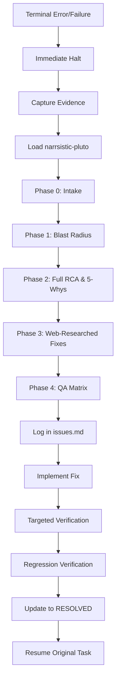

# Incident RCA Workflow

## Trigger Conditions
This workflow is triggered automatically upon ANY terminal error, test failure, build failure, lint error, or runtime exception. **Zero exceptions allowed.** 

## Execution Steps

1. **Immediate Halt Protocol:** Stop all other work immediately. Do not attempt "quick fixes" or retries.
2. **Evidence Capture:** Gather the full terminal output, context of the affected files, and a diff of recent changes.
3. **Load Skill:** Load the `narrsistic-pluto` skill for deep analysis.
4. **Phase 0 - Task Intake:** Document what the agent was trying to do when the error occurred.
5. **Phase 1 - Blast Radius:** Assess what else could be broken or affected by this failure.
6. **Phase 2 - Full RCA:** Execute Root Cause Analysis. Create the Fault Activation Chain and apply 5-Whys/Fishbone to find the underlying issue.
7. **Phase 3 - Solutions:** Web-research 3-5 fix approaches based on current patterns.
8. **Phase 4 - QA Matrix:** Compare fixes with a targeted QA matrix. Define rollback triggers for the fix.
9. **Log Issue:** Log the incident in `.agents/state/issues.md` using the full ISSUE-XXXX template.
10. **Implement Fix:** Apply the chosen, accepted fix.
11. **Targeted Verification:** Reproduce the original error to confirm it fails, then verify the fix resolves it.
12. **Regression Verification:** Ensure adjacent functionality still works.
13. **Resolve:** Update `issues.md` status to RESOLVED with evidence.
14. **Resume:** Resume the original task work.

## Process Flow Diagram

