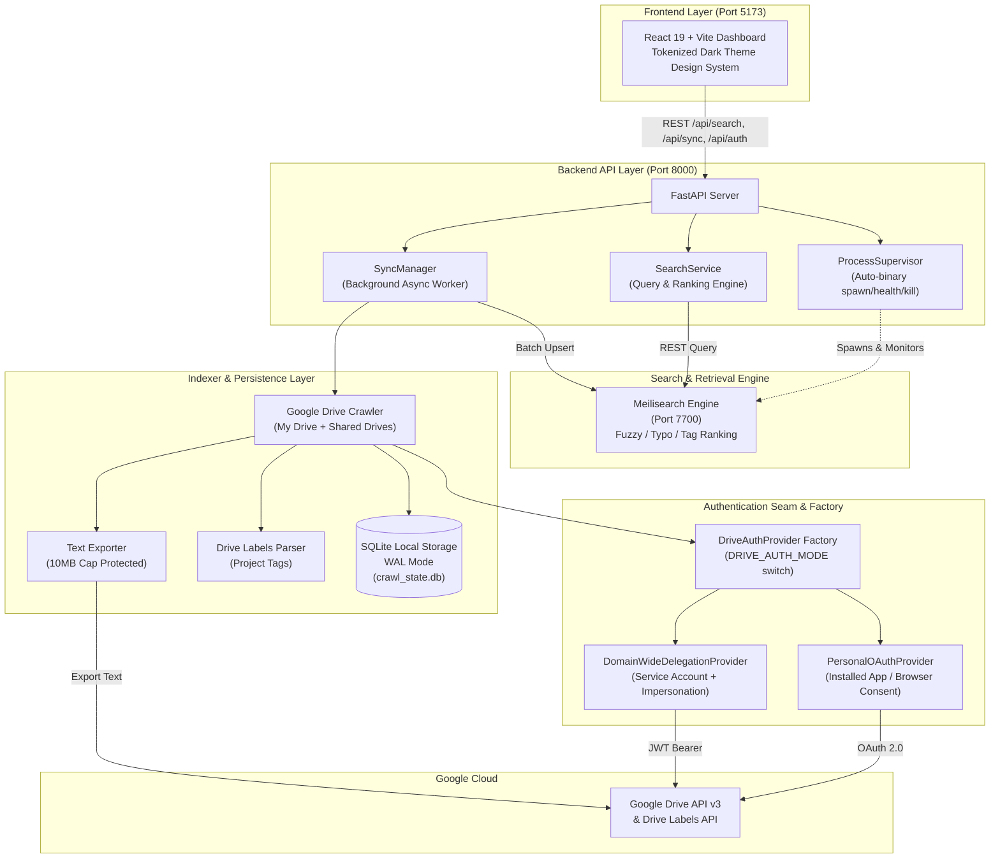

# 🔭 Panopticon Observatory

> **High-speed, typo-tolerant document discovery and project navigation engine for Google Workspace (Google Docs & Google Sheets).**

[](https://www.python.org/)
[](https://fastapi.tiangolo.com/)
[](https://react.dev/)
[](https://vitejs.dev/)
[](https://www.meilisearch.com/)
[](https://tailwindcss.com/)

---

## 📖 Table of Contents
- [Executive Overview](#-executive-overview)
- [Key Features](#-key-features)
- [System Architecture](#-system-architecture)
- [Tech Stack](#-tech-stack)
- [Getting Started](#-getting-started)
  - [Prerequisites](#prerequisites)
  - [1. Backend Setup](#1-backend-setup)
  - [2. Frontend Setup](#2-frontend-setup)
  - [3. Running the Application](#3-running-the-application)
- [Security Model & Constraints](#-security-model--constraints)
- [License](#-license)

---

## 🌟 Executive Overview

In engineering and product organizations, critical project specifications, RFCs, tracking spreadsheets, and architecture blueprints are scattered across hundreds of Google Docs and Google Sheets in personal drives, Shared Drives, and team folders.

Traditional Google Drive search struggles with strict substring matching, lack of typo tolerance for project codenames, and sluggish latency.

**Panopticon** acts as a **lightweight, local-first search pointer and discovery layer**. It indexes document titles, owner/editor metadata, governed project label tags, and extracted content snippets into a specialized [Meilisearch](https://www.meilisearch.com/) engine—allowing users to find any relevant document in **under 20ms**, even with typos.

```
       ┌────────────────────────────────────────────────────────┐
       │                   The User Query                       │
       │     e.g., "Falcn architecture", "SmartTrde sheet"      │
       └───────────────────────────┬────────────────────────────┘
                                   │
                                   ▼
       ┌────────────────────────────────────────────────────────┐
       │                  PANOPTICON ENGINE                     │
       │   1. Governed Drive Label Project Tags   [HIGH PRIO]   │
       │   2. Exact & Fuzzy Document Titles       [MED-HIGH]    │
       │   3. Typo-Tolerant Snippet Matches       [MEDIUM]      │
       └───────────────────────────┬────────────────────────────┘
                                   │
                                   ▼
       ┌────────────────────────────────────────────────────────┐
       │               Instant Document Pointer                 │
       │  • Direct "View in Google Drive" Link                  │
       │  • One-Click Direct Export (PDF, DOCX, XLSX, CSV)      │
       │  • Match Attribution Badge ([TAG:HIGH], etc.)          │
       │  • Owner & Sharing Status (Private / Shared / Domain)  │
       └────────────────────────────────────────────────────────┘
```

---

## ✨ Key Features

### 🔍 Typo-Tolerant Hybrid Search
- **Sub-20ms Search Latency:** Powered by Meilisearch with custom ranking rules (`words > typo > proximity > attribute > sort > exactness`).
- **Hybrid Matching Intelligence:** Prioritizes governed Google Workspace Drive Labels (`[TAG:HIGH]`), elevates title matches (`[TITLE:HIGH]`), and provides full-text snippet fallback (`[CONTENT:MEDIUM]`).
- **Interactive Highlighting:** Renders highlighted `<mark>` terms in document titles and preview snippets.
- **Direct Export Menus:** One-click downloads for `PDF`, `DOCX`, `XLSX`, and `CSV` directly from Google Drive export endpoints.
- **Keyboard Shortcuts:** Press `/` or `Cmd/Ctrl + K` to focus the search bar, and `Escape` to clear.

### 🔄 Background Sync & Ingestion Engine
- **Incremental Crawling (`modifiedTime`):** Uses SQLite-persisted watermarks to crawl only modified or newly created files.
- **10MB Export Cap Protection:** Gracefully catches Google's server-side export ceiling, marking oversized files as `oversized_metadata_only` instead of failing the run.
- **Ghost Entry Purging:** Automatically detects deleted/moved files in Google Drive and removes them from both SQLite and Meilisearch.
- **Live UI Progress Drawer:** Real-time phase tracking (`crawling ➔ exporting ➔ updating_sqlite ➔ indexing_meilisearch`) with live stats.

### 🔐 Dual Swappable Authentication
- **Personal OAuth 2.0:** Installed-app browser popup consent flow with automatic token refreshing (`credentials.json` + `token.json`).
- **Domain-Wide Delegation (DWD):** Google Workspace service account with subject email impersonation for company-wide deployment.
- **Zero-Restart Hot-Switching:** Switch between OAuth and Service Account modes directly from the UI settings drawer or REST API.

### 🛠️ Zero-Setup Process Supervision
- **Managed Engine Binary:** FastAPI startup lifespan auto-detects, auto-downloads (if missing), spawns, and supervises the local `meilisearch` child process, with clean termination on shutdown.

---

## 🏛️ System Architecture



---

## 💻 Tech Stack

| Layer | Technologies |
|---|---|
| **Backend API** | Python 3.12, FastAPI, Pydantic v2, Uvicorn |
| **Search Engine** | Meilisearch (supervised standalone binary) + Meilisearch Python SDK |
| **Persistence Layer** | SQLite 3 (WAL Journal Mode, ACID transactions) |
| **Google Integrations** | Google API Client, Google Auth OAuthlib, Drive API v3, Drive Labels API |
| **Frontend Dashboard** | React 19, TypeScript, Vite 6, Tailwind CSS 3 |

---

## 🚀 Getting Started

### Prerequisites
- **Python:** 3.10 or higher
- **Node.js:** 18 or higher (with npm)
- **Google Cloud Project:** Enabled Google Drive API & Drive Labels API (with `credentials.json` for OAuth or `service_account.json` for DWD).

---

### 1. Backend Setup

1. **Clone the repository:**
   ```bash
   git clone https://github.com/Mubashar986/Panopticon.git
   cd Panopticon
   ```

2. **Create and activate a virtual environment:**
   ```bash
   python -m venv .venv
   # Windows:
   .venv\Scripts\activate
   # macOS/Linux:
   source .venv/bin/activate
   ```

3. **Install Python dependencies:**
   ```bash
   pip install -e .
   ```

4. **Configure environment variables:**
   ```bash
   cp .env.example .env
   ```
   *(Ensure `GOOGLE_CLIENT_SECRETS_FILE=credentials.json` is set).*

---

### 2. Frontend Setup

1. **Navigate to the frontend directory:**
   ```bash
   cd frontend
   ```

2. **Install Node dependencies:**
   ```bash
   npm install
   ```

---

### 3. Running the Application

#### Terminal 1 — Start the Backend (with Supervised Meilisearch):
```bash
uvicorn app.api.app:app --host 127.0.0.1 --port 8000 --reload
```
*The FastAPI lifespan will automatically verify and spawn `meilisearch.exe` on port `7700` if not already running.*

#### Terminal 2 — Start the React Dashboard:
```bash
cd frontend
npm run dev
```

Open **`http://localhost:5173`** in your browser to access the **Panopticon Observatory**!

---

## 🛡️ Security Model & Constraints

1. **Zero-Mirroring Guarantee:** Panopticon is strictly a pointer index. Full document text is never mirrored or stored in SQLite, Meilisearch, or API responses.
2. **Local-Only Search Execution:** Search requests never make live Google Drive API calls; queries execute against the local Meilisearch index in <20ms.
3. **Untrusted Input Sanitization:** All titles, authors, and snippets are sanitized against illegal control characters (`[\x00-\x08\x0b\x0c\x0e-\x1f\x7f]`).
4. **Credential Isolation:** OAuth tokens and service account secrets are never exposed via API responses or committed to Git.
5. **10MB Server-Side Cap Handling:** Large files gracefully fall back to metadata-only indexing without interrupting crawl jobs.

---

## 📄 License

Panopticon is open-source software licensed under the [MIT License](LICENSE).
