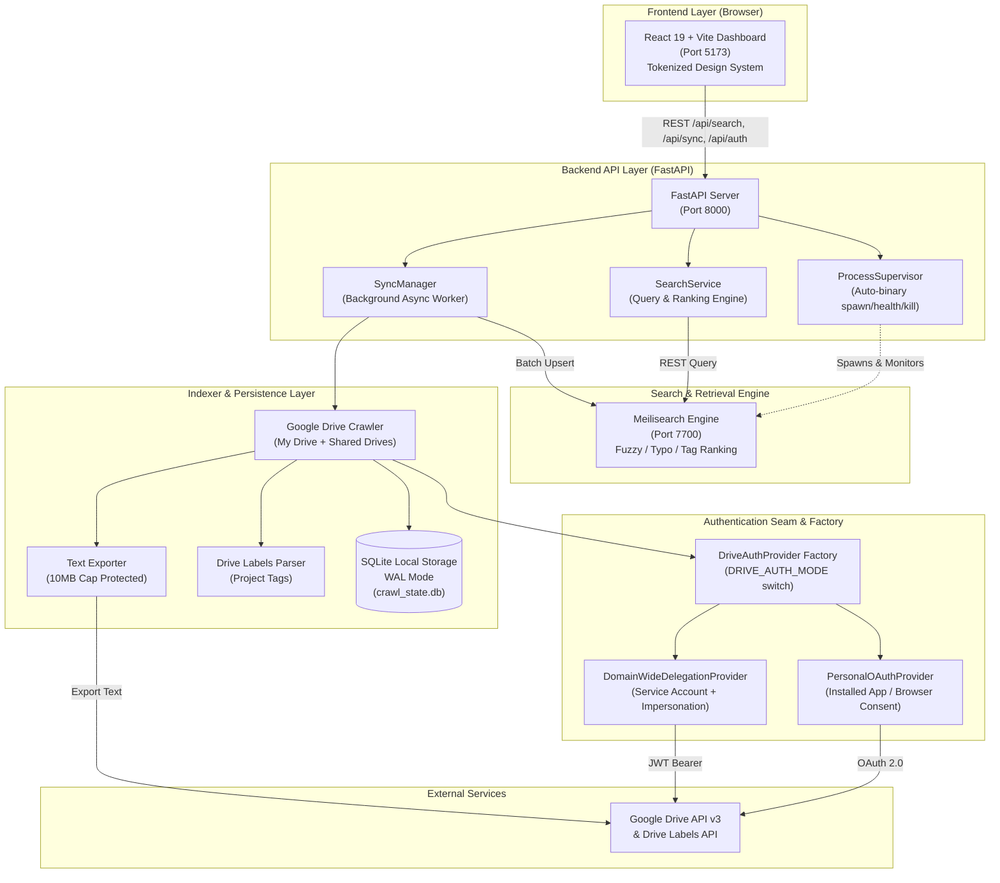
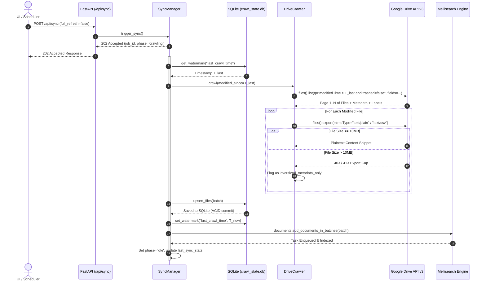
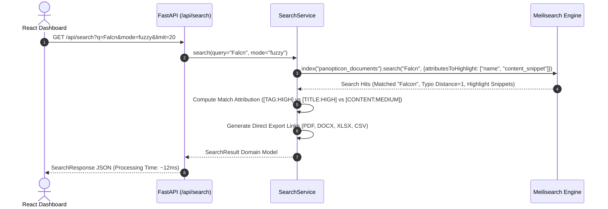
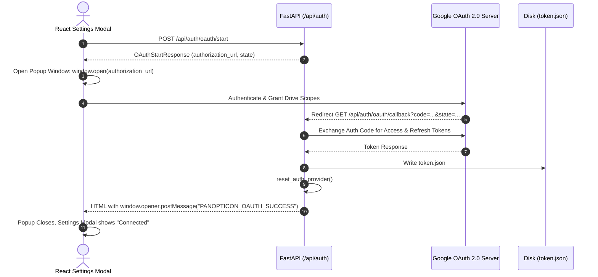

# System Design Document (SDD) — Panopticon

---

## 1. System Architecture & Topology Overview

Panopticon is engineered as a modular, local-first search system designed to index Google Docs and Google Sheets metadata, project labels, and content snippets into an embedded high-performance search index ([Meilisearch](https://www.meilisearch.com/)).



---

## 2. Core Architectural Decisions (ADR Reference Matrix)

The system adheres strictly to the architectural standards defined in the project ADR index:

| ADR ID | Decision Title | Selected Strategy | Rationale & Trade-Offs |
|---|---|---|---|
| **ADR-0001** | Search Engine Technology | **Meilisearch** (Standalone Engine) | Sub-15ms typo-tolerant search, lightweight footprint, out-of-the-box prefix and proximity ranking without heavy Elasticsearch JVM overhead. |
| **ADR-0002** | Google Drive Authentication Strategy | **Dual Swappable Provider via Factory** | `PersonalOAuthProvider` enables immediate local dev; `DomainWideDelegationProvider` enables instant company deployment with zero code changes. |
| **ADR-0003** | Crawl State Persistence Layer | **SQLite (WAL Mode)** | ACID durability, zero-setup embedded storage, atomic watermark updates, and structured querying for deleted file diffing. |
| **ADR-0004** | Backend Framework Selection | **FastAPI + Pydantic v2** | Native asynchronous execution for non-blocking search and background crawl orchestration, high-speed serialization, and auto-generated OpenAPI. |
| **ADR-0005** | Frontend Architecture & Styling | **React 19 + Vite + TypeScript + Design Tokens** | Type-safe UI matching backend contracts, sub-second HMR, strict adherence to `design-system/tokens.json` (zero raw hex/px drift). |

---

## 3. Subsystem Breakdown & Component Responsibilities

### 3.1 Dual Authentication Layer (`app/core/auth/`)
- **`DriveAuthProvider` Protocol (`base.py`)**: Abstract protocol enforcing `get_credentials() -> Credentials` and `build_drive_service()`.
- **`PersonalOAuthProvider` (`oauth.py`)**: Handles user consent flow via `credentials.json`, caching tokens in `token.json` with automatic token refresh.
- **`DomainWideDelegationProvider` (`service_account.py`)**: Loads `service_account.json` and delegates subject email impersonation via Google JWT tokens.
- **`DriveAuthFactory` (`factory.py`)**: Reads runtime settings and hot-switches providers on the fly without server restarts.

### 3.2 Ingestion & Sync Pipeline (`app/indexer/`)
- **`DriveCrawler` (`crawler.py`)**: Traverses Google Drive using `pageToken` pagination, `supportsAllDrives=True`, and `includeItemsFromAllDrives=True`. Filters to Docs (`application/vnd.google-apps.document`) and Sheets (`application/vnd.google-apps.spreadsheet`).
- **`ContentExporter` (`exporter.py`)**: Exports text from Google Docs (`text/plain`) and Sheets (`text/csv`). Protects system memory and network by enforcing the **10MB Google server-side export ceiling**; oversized documents are flagged `oversized_metadata_only`.
- **`DriveLabelsParser` (`labels.py`)**: Queries and extracts structured Google Workspace Labels (`labels/ID.FIELD_ID`) attached to files.
- **`PermissionsNormalizer` (`permissions.py`)**: Maps Drive ACLs into clean categorical sharing statuses (`private`, `shared`, `domain`, `anyone`).
- **`CrawlStorage` (`storage.py`)**: SQLite repository managing `file_records` and `sync_state` with WAL journaling and indexed watermarking (`modified_time`).

### 3.3 Search & Retrieval Engine (`app/search/`)
- **`MeiliSearchClient` (`client.py`)**: High-level typed adapter wrapping Meilisearch SDK with automatic index provisioning, health checks, and connection retries.
- **`SearchIngestionEngine` (`ingestion.py`)**: Batch upserts normalized `SearchDocument` records into Meilisearch; removes deleted documents in sync passes.
- **`SearchService` (`service.py`)**: Executes structured search queries with typo tolerance, facet filtering (`file_type`, `sharing_status`, `project_tag`), sort rules, and HTML `<mark>` snippet highlight generation.
- **Ranking Rules Configuration (`schema.py`)**:
  ```python
  INDEX_RANKING_RULES = [
      "words",       # Number of matched query terms
      "typo",        # Number of typos (fewer typos rank higher)
      "proximity",   # Distance between matched terms
      "attribute",   # Attribute weight: project_tags > name > content_snippet
      "sort",        # User-requested sort order
      "exactness",   # Exact matches rank above fuzzy approximations
  ]
  ```

### 3.4 Process Supervisor & Binary Bootstrap (`app/core/supervisor.py`)
- Automatically detects if the Meilisearch binary is present in `bin/meilisearch.exe` (auto-downloads appropriate platform binary if missing).
- Spawns Meilisearch child process on FastAPI lifespan startup if not already running on port 7700.
- Probes `/health` endpoint until engine is ready before routing API requests.
- Gracefully terminates child process with `SIGTERM`/`SIGINT` during backend application shutdown.

### 3.5 Asynchronous REST API Layer (`app/api/`)
- **`Search Routes` (`routes/search.py`)**: `GET /api/search` executes typo-tolerant queries against Meilisearch in <20ms.
- **`Sync Routes` (`routes/sync.py`)**: `POST /api/sync` triggers non-blocking background crawler; `GET /api/sync/status` provides live polling telemetry.
- **`Auth Routes` (`routes/auth.py`)**: Manages Google OAuth consent loops, credential uploads, and provider hot-switching.
- **`Health Routes` (`routes/health.py`)**: Liveness probes and deep engine diagnostic telemetry.

---

## 4. End-to-End Data Flow & Sequence Diagrams

### 4.1 Crawl, Ingestion & Watermark Synchronization Flow



### 4.2 Typo-Tolerant Search Query Flow



### 4.3 OAuth 2.0 Web Popup Consent Flow



---

## 5. Data Storage Schemas & Models

### 5.1 SQLite Persistence Schema (`crawl_state.db`)

```sql
-- Sync state and watermarking table
CREATE TABLE IF NOT EXISTS sync_state (
    key TEXT PRIMARY KEY,
    value TEXT NOT NULL,
    updated_at TEXT NOT NULL
);

-- Normalized file records store
CREATE TABLE IF NOT EXISTS file_records (
    id TEXT PRIMARY KEY,
    name TEXT NOT NULL,
    mime_type TEXT NOT NULL,
    modified_time TEXT,
    created_time TEXT,
    owners_json TEXT,
    last_modifying_user TEXT,
    shared INTEGER NOT NULL DEFAULT 0,
    web_view_link TEXT,
    icon_link TEXT,
    size_bytes INTEGER,
    trashed INTEGER NOT NULL DEFAULT 0,
    parents_json TEXT,
    drive_id TEXT,
    sharing_status TEXT NOT NULL DEFAULT 'private',
    permissions_json TEXT,
    labels_json TEXT,
    project_tags_json TEXT,
    content_snippet TEXT,
    export_status TEXT,
    last_seen_at TEXT NOT NULL
);

-- Performance indices
CREATE INDEX IF NOT EXISTS idx_file_modified_time ON file_records(modified_time);
CREATE INDEX IF NOT EXISTS idx_file_sharing_status ON file_records(sharing_status);
CREATE INDEX IF NOT EXISTS idx_file_trashed ON file_records(trashed);
CREATE INDEX IF NOT EXISTS idx_file_last_seen_at ON file_records(last_seen_at);
```

### 5.2 Meilisearch Document Schema (`SearchDocument`)

```json
{
  "id": "1A2B3C4D5E6F7G8H9I0J",
  "name": "Project Falcon - Technical Architecture RFC",
  "mime_type": "application/vnd.google-apps.document",
  "file_type": "document",
  "modified_time": "2026-08-25T14:30:00Z",
  "created_time": "2026-06-10T09:15:00Z",
  "primary_owner": "alex.architect@company.com",
  "owners": ["alex.architect@company.com", "tech-leads@company.com"],
  "last_modifying_user": "alex.architect@company.com",
  "sharing_status": "domain",
  "project_tags": ["Falcon", "RFC", "Architecture"],
  "content_snippet": "This document defines the core architecture for Project Falcon...",
  "export_status": "success",
  "web_view_link": "https://docs.google.com/document/d/1A2B3C4D5E6F7G8H9I0J/edit",
  "icon_link": "https://drive-thirdparty.googleusercontent.com/16/type/application/vnd.google-apps.document",
  "size_bytes": 45210
}
```

---

## 6. Security, Resilience & Failure Recovery

### 6.1 Zero-Mirroring Data Boundary
To satisfy enterprise compliance and data governance:
- **No full document text** is ever mirrored into SQLite or Meilisearch.
- Plaintext export streams are truncated to short preview snippets (~1000 characters).
- API responses provide direct pointers to Google Drive rather than housing sensitive payload copies.

### 6.2 Untrusted String Sanitization
All metadata ingested from Google Drive (filenames, author names, labels, content) is cleaned via precompiled regex `[\x00-\x08\x0b\x0c\x0e-\x1f\x7f]` to prevent control-character injection attacks in search indices and JSON parsers.

### 6.3 Concurrency & Lock Management
The `SyncManager` implements a thread-safe atomic lock (`threading.Lock`). Simultaneous requests to `/api/sync` or `/api/sync/reindex` immediately receive `HTTP 409 Conflict`, preventing write collisions on SQLite and Meilisearch.

### 6.4 Failure Modes & Self-Healing

| Failure Scenario | Detection Mechanism | Automated Recovery Strategy |
|---|---|---|
| **Meilisearch Process Crash** | FastAPI lifespan health probing / `health_check()` | `ProcessSupervisor` detects process drop, logs warning, and auto-spawns binary in background. Search queries return HTTP 503 during downtime. |
| **Google Drive 10MB Export Cap** | HTTP 403/413 error during `files().export()` | Caught in `ContentExporter`; records `export_status="oversized_metadata_only"` and continues crawl without interruption. |
| **Google OAuth Token Expiration** | `creds.expired` or Google API 401 | `PersonalOAuthProvider` automatically uses refresh token to acquire fresh credentials. If unrecoverable, returns explicit status in `/api/auth/config`. |
| **Corrupted Search Index** | HTTP 503 / `IndexNotFoundError` | Operator triggers `POST /api/sync/reindex`; re-pushes all documents from SQLite into Meilisearch with zero Drive API calls. |
