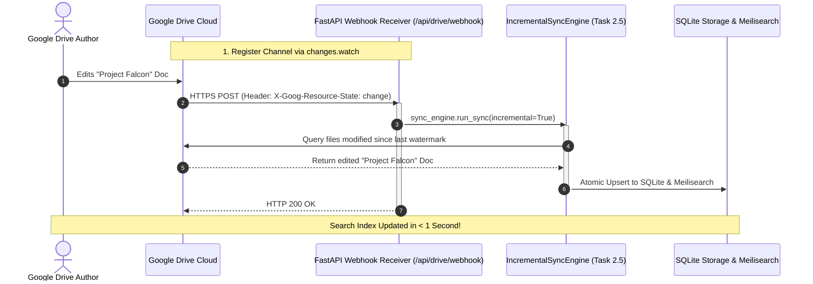

# RFC-0001: Real-Time Google Drive Webhook Synchronization (changes.watch)

**Status:** Proposed (Scheduled for Post-MVP Epic 6)  
**Date:** 2026-08-28  
**Target Epic:** Epic 6: Real-Time Push Sync & Webhook Subsystem  

---

## 1. Executive Summary

Currently, Panopticon synchronizes Google Drive changes on-demand or via periodic watermark polling (Task 2.5: `IncrementalSyncEngine`).

This RFC proposes adding **Google Drive Push Notifications (`changes.watch`)** to enable real-time sub-second search indexing. When an author modifies or deletes a document in Google Drive, Google immediately sends an HTTPS POST webhook to Panopticon, triggering an instant incremental delta sync.

---

## 2. Architecture & Data Flow

---

## 3. Regression Impact & Blast Radius Assessment

| Evaluation Dimension | Assessment | Rationale |
|---|---|---|
| **Blast Radius** | 🟢 **Minimal / Low** | The webhook receiver is purely an external event trigger. It does not alter the core crawler, parser, or search engine. |
| **Existing Code Reuse** | 🟢 **100% Reuse** | The webhook endpoint simply calls `IncrementalSyncEngine.run_sync()` (built in Task 2.5). |
| **Backward Compatibility** | 🟢 **100% Compatible** | Polling and manual sync remain available as fallbacks if the webhook channel expires or is disabled. |

---

## 4. Technical Requirements for Implementation

1. **FastAPI Endpoint:** `POST /api/drive/webhook` receiving Google `X-Goog-Resource-State` headers.
2. **Channel Watch Registrar:** Service dispatching `service.changes().watch(body={"id": channel_id, "type": "web_hook", "address": webhook_url})`.
3. **Channel Expiration Renewal:** Background scheduler renewing watch channels before the 7-day expiration ceiling.
4. **Local Development Gateway:** Optional `ngrok` or Cloudflare Tunnel configuration for local testing.

---

## 5. Decision & Roadmap Alignment

- **Phase 1 (Current):** Complete Epic 2 (Task 2.5 SQLite Watermark Sync) $\rightarrow$ Epic 3 (Meilisearch) $\rightarrow$ Epic 4 (FastAPI) $\rightarrow$ Epic 5 (React Dashboard).
- **Phase 2 (Post-MVP):** Implement Epic 6: Real-Time Drive Webhooks & Push Sync using the exact architecture specified in this RFC.
