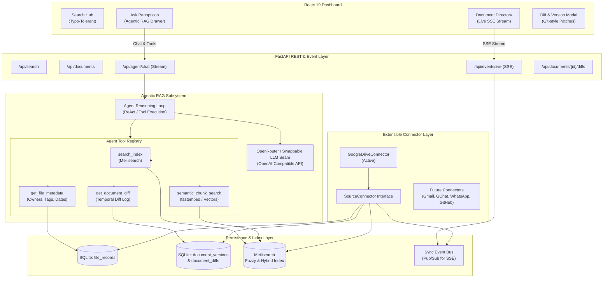

# Roadmap & WBS Plan — Panopticon (Phase 2: Agentic RAG, Version Diffing & Live Directory)

## 1. Planning Context

| Property | Value |
|----------|-------|
| Project/Feature | **Panopticon** — Real-Time Document Directory, Temporal Version Diffing, and Agentic RAG (Phase 2 of Multi-Source Enterprise Intelligence) |
| User Goal | 1. Browse tracked documents in real-time with live modification updates (SSE).<br>2. Track temporal document diffs (unified Git-like patches + AI change summaries).<br>3. Ask complex questions via **Agentic RAG** (powered by OpenRouter / swappable LLM) with temporal awareness, multi-doc synthesis, and verified Drive citations.<br>4. Architect pluggable `SourceConnector` abstractions for future Gmail, GChat, WhatsApp, GitHub, and Bitbucket integrations. |
| Learning Goal | Mix: move fast through Python backend abstractions; explore Agentic tool-use loops, Server-Sent Events (SSE), AST/text diff algorithms, vector embeddings (fastembed / Meilisearch hybrid), and multi-document reasoning. |
| Target User | Internal team — PMs, team leads, software engineers, DevOps |
| Stack Detected/Confirmed | Python 3.12 (FastAPI, SQLite WAL, Pydantic v2), Meilisearch (Fuzzy + Hybrid Vector Index), OpenRouter / Swappable LLM Provider (`fastembed` embeddings), React 19 + TypeScript + Vite + Design Tokens. |
| Planning Date | 2026-08-31 |
| Planning Status | Ready for Stage 1 |

---

## 2. User Answers and Assumptions

### Confirmed by User
- **Phase 1 Baseline Complete**: Epics 1–6 (Swappable Auth, Drive Crawler, Text Exporter, SQLite Persistence, Meilisearch Engine, FastAPI REST API, and React Dashboard) are fully operational and verified.
- **LLM Strategy**: Cloud-first API with a **swappable hybrid provider** where users can input custom API keys (via `.env` or UI Settings Drawer). Development uses **OpenRouter API** for unified model access (Gemini, Claude, GPT-4o, DeepSeek, Llama 3).
- **Document Version Diffing**: **Hybrid Diffing**:
  1. *Patch-based text diffs:* Unified Git-style diff patches stored in SQLite per version change.
  2. *AI-generated semantic change summaries:* 2-sentence summary of modifications generated during incremental sync.
- **Agentic RAG Capabilities**:
  1. *Temporal change tracking:* Answering *"When was doc X changed and what got changed?"*
  2. *Multi-document synthesis:* Comparing and cross-referencing information across multiple Docs and Sheets.
  3. *Direct citation & pointer verification:* Every agent answer is backed by verified Google Drive URLs and highlighted excerpt anchors.
- **Real-Time Delivery & UI Directory**:
  - Live **Document Directory View** in the dashboard with auto-refreshing via **Server-Sent Events (SSE)** and periodic watermark heartbeat.
  - Visual indicators: Relative edit timestamps ("Modified 5 min ago"), daily edit count badge, and changed section previews.
- **Future Multi-Source Readiness**: Stick to Google Docs & Sheets for active implementation now, but architect standardized `SourceConnector` and `UniversalDocument` interfaces to enable plug-and-play addition of Gmail, GChat, WhatsApp, GitHub, and Bitbucket with zero core domain rewrites.

### Inferred from Codebase
- SQLite in WAL mode (`app/indexer/storage.py`) provides ideal transactional support for storing `document_versions` and `document_diffs`.
- `ContentExporter` (`app/indexer/exporter.py`) already extracts clean sanitized text streams from Docs and Sheets, ready for diffing and chunking.
- `FastAPI` async architecture (`app/api/app.py`) is fully compatible with `StreamingResponse` for Server-Sent Events (SSE) and token-streaming LLM completions.

### Assumptions to Validate
- OpenRouter API format follows standard OpenAI REST specs (`/chat/completions`), allowing drop-in compatibility with local Ollama or proprietary endpoints.
- Chunk embeddings can be computed locally on CPU in <15ms using `fastembed` (ONNX runtime) without requiring GPU or heavy PyTorch dependencies.

---

## 3. Current Codebase Snapshot

- **Existing Backend**: FastAPI with `/api/search`, `/api/sync`, `/api/auth`, `/api/health`, `/api/system`, and background `SyncManager`.
- **Existing Storage**: SQLite (`crawl_state.db`) with `sync_state` and `file_records` tables, WAL mode, ACID transactions.
- **Existing Search**: Meilisearch supervised process, custom ranking rules (`words`, `typo`, `proximity`, `attribute`, `sort`, `exactness`), match attribution (`[TAG:HIGH]`, `[TITLE:HIGH]`, `[CONTENT:MEDIUM]`).
- **Existing Frontend**: Vite + React 19 + TypeScript dashboard with Picasso design tokens, search bar, mode selector, filter bar, results list, export links, sync drawer, auth settings modal, and system health pill.
- **Important Constraints**: Zero-mirroring policy (pointers only), 10MB Drive export cap graceful fallback, untrusted string sanitization, thread-safe sync locks.

---

## 4. Brainstormed Directions

| Option | Description | Teaches | Complexity | Pros | Cons |
|---|---|---|---|---|---|
| **A — Naive Vector RAG Only** | Basic single-shot vector retrieval + LLM prompt. | Basic embeddings & prompt engineering. | Low | Quick to build. | Cannot answer temporal questions (*"what changed"*), lacks multi-step reasoning, prone to hallucinated citations. |
| **B — Full Agentic RAG + Hybrid Diffing + SSE Stream (Chosen)** | Multi-tool reasoning loop (search, diffs, metadata, vectors) + unified Git diffs + AI change summaries + SSE live document catalog. | Agentic architecture, AST/text diffing, Server-Sent Events, OpenRouter integration, tool-use orchestration. | Medium-High | Solves temporal change tracking, provides verified citations, delivers real-time live UI, fully extensible to future sources. | Requires disciplined tool design and token budget management. |
| **C — Heavy Graph RAG + Full Document Storage** | Graph database (Neo4j) + full text mirroring. | Knowledge graphs. | Very High | Deep entity relationships. | Violates zero-mirroring constraint, heavy operational overhead, overkill for project document discovery. |

---

## 5. Scope Decision (MoSCoW)

### Must Have
- **Document Directory API & UI**: `GET /api/documents` with sorting, filtering, and live Server-Sent Events (SSE) event stream (`GET /api/events/live`).
- **Document Version Diff Engine**: Content hashing, unified diff patch calculation, and SQLite `document_versions` / `document_diffs` persistence.
- **OpenRouter / Swappable LLM Seam**: `LLMClient` supporting OpenRouter, custom OpenAI-compatible endpoints, and API key management in Settings Drawer.
- **Agentic RAG Core**: Tool-calling agent engine with 4 tools: `search_index`, `get_document_diff`, `get_file_metadata`, and `semantic_chunk_search`.
- **Temporal & Multi-Doc Q&A**: Reasoning over version diffs (*"what changed"*) and synthesis across multiple Docs/Sheets with verified Drive URLs.
- **Extensible `SourceConnector` Seam**: Standardized protocol interface ready for Phase 3 connectors (Gmail, GChat, WhatsApp, GitHub, Bitbucket).

### Should Have
- Live visual indicators on document cards ("Modified 5 min ago", "2 edits today").
- Document Version History & Diff Inspector modal in dashboard.
- Streaming LLM token responses in the "Ask Panopticon" chat drawer.

### Could Have
- Automatic periodic background sync heartbeat scheduler (e.g. every 60s).
- Query suggestion chips in the Agentic RAG interface.

### Won't Have Yet (Phase 3+)
- Live Gmail, GChat, WhatsApp, GitHub, Bitbucket connector implementations (interfaces will be ready; concrete connector crawlers scheduled for Phase 3).
- Multi-user authentication & cloud deployment.

---

## 6. Architecture Direction



---

## 7. Roadmap Overview

| Milestone | Goal | Outcome | Depends On |
|---|---|---|---|
| **M1: Baseline Engine** | Foundation, Auth, Ingestion, Search, API, UI | Phase 1 Completed & Verified (Epics 1–6) | None |
| **M2: Live Directory & SSE** | Real-Time Document Catalog & Live Event Stream | Users can browse all tracked documents with live auto-refreshing via SSE | M1 |
| **M3: Temporal Diff Engine** | Document Versioning & Change Intelligence | Git-style text delta patches + AI change summaries stored in SQLite | M2 |
| **M4: Agentic RAG Assistant** | "Ask Panopticon" OpenRouter Tool-Calling Agent | Temporal Q&A, multi-doc synthesis, verified Drive citations, chat drawer | M3 |
| **M5: Enterprise Workspace & Dossiers** | Project Dossiers, Scoped RAG, Web OAuth & Desktop UI | Multi-tenant project vaults, "Ask Dossier" isolation, 1-click Google sign-in, redesigned React desktop | M4 |
| **M6: Extensible Multi-Source Connectors** | Universal `SourceConnector` Framework | Standardized contracts ready for Gmail, GChat, WhatsApp, GitHub, Bitbucket | M5 |

---

## 8. Work Breakdown Structure (Phase 2 Epics)

### Epic 7: Live Document Directory & Real-Time Sync Stream

#### 7.1 Build the Document Directory API (`GET /api/documents`)
- **Goal:** Endpoint to browse all indexed documents with pagination, sorting (`modified_time:desc`, `name:asc`), and facet filtering (`file_type`, `sharing_status`, `project_tag`, `primary_owner`) without requiring a search keyword.
- **Main concept learned:** Database cursor/offset query pagination and domain-to-API DTO projection.
- **Why this comes here:** Provides the backend contract for the browsable document directory.
- **Depends on:** Epic 4
- **Estimated time:** 45 min
- **Difficulty:** Beginner
- **Acceptance criteria:**
  - [ ] `GET /api/documents` returns paginated list of `DriveFileMetadata` models.
  - [ ] Supports `sort_by=modified_time:desc`, `limit`, `offset`, and facet filters.
  - [ ] Unit & integration tests pass with 100% assertions.
- **Verification idea:** Call `/api/documents?sort_by=modified_time:desc&limit=10` and verify newest modified files appear first.
- **Next lifecycle skill:** `concept-to-code-bridge`

#### 7.2 Implement Server-Sent Events (SSE) Live Event Stream & Sync Event Bus
- **Goal:** Build an in-memory asynchronous `SyncEventBus` (Pub/Sub) and expose `GET /api/events/live` as a `StreamingResponse` broadcasting `file_created`, `file_modified`, `file_deleted`, and `sync_completed` events.
- **Main concept learned:** Asynchronous generator event streaming, HTTP Server-Sent Events (`text/event-stream`), and disconnected client cleanup.
- **Why this comes here:** Enables the frontend to update reactively in real time without polling.
- **Depends on:** 7.1
- **Estimated time:** 60 min
- **Difficulty:** Intermediate
- **Acceptance criteria:**
  - [ ] `SyncEventBus.publish(event)` broadcasts to all active subscriber queues.
  - [ ] `GET /api/events/live` streams events with proper SSE protocol (`event:`, `data:`, `id:`).
  - [ ] Disconnected clients are pruned cleanly without memory leaks.
- **Verification idea:** Connect curl/browser to `/api/events/live`, trigger a sync in another terminal, and verify live events are streamed instantly.
- **Next lifecycle skill:** `concept-to-code-bridge`

#### 7.3 Build React Document Directory View & Live Activity Stream
- **Goal:** Add a toggleable "Directory" view in the React dashboard with document cards, relative edit timestamps ("Modified 5 min ago by Alex"), and live SSE subscription updating cards in real time.
- **Main concept learned:** React SSE hook (`EventSource`), dynamic sorting state, and optimistic UI transitions.
- **Why this comes here:** Delivers the intuitive visual browsing experience requested by the user.
- **Depends on:** 7.1, 7.2
- **Estimated time:** 60 min
- **Difficulty:** Intermediate
- **Acceptance criteria:**
  - [ ] Directory view renders all tracked Docs and Sheets sorted by modification time.
  - [ ] Receiving an SSE event smoothly updates the card position and highlights the modified file with a visual badge.
  - [ ] Adheres 100% to design tokens (zero raw hex/px).
- **Verification idea:** Open dashboard, modify a test doc, trigger sync, and watch card update position live without page reload.
- **Next lifecycle skill:** `escher` / `vermeer`

---

### Epic 8: Document Version Diffing & Temporal Change Engine

#### 8.1 Create SQLite Version Snapshot & Diff Storage Schema
- **Goal:** Create `document_versions` (storing content SHA-256 hash, snapshot text, timestamp, editor) and `document_diffs` (storing unified diff patch, AI summary, lines added/removed) in SQLite.
- **Main concept learned:** Relational versioning patterns, content-addressable hashing, and storage compaction.
- **Why this comes here:** Foundation for temporal change intelligence.
- **Depends on:** 7.1
- **Estimated time:** 45 min
- **Difficulty:** Intermediate
- **Acceptance criteria:**
  - [ ] Migration adds `document_versions` and `document_diffs` tables with foreign keys and indices.
  - [ ] `CrawlStorage` methods `save_version()`, `save_diff()`, and `get_version_history(file_id)` implemented and tested.
- **Verification idea:** Unit tests verify inserting 3 versions of a file and retrieving historical diff records.
- **Next lifecycle skill:** `concept-to-code-bridge`

#### 8.2 Build Text Patch Diff Engine
- **Goal:** Implement unified diff computation (`difflib.unified_diff`) comparing previous snapshot text with newly crawled text on incremental sync watermark change.
- **Main concept learned:** Delta compression, Myers diff algorithm concepts, and line-level patch generation.
- **Why this comes here:** Generates the exact Git-style diff patches for modified documents.
- **Depends on:** 8.1
- **Estimated time:** 60 min
- **Difficulty:** Intermediate
- **Acceptance criteria:**
  - [ ] `DiffEngine.compute_diff(old_text, new_text)` returns structured `DiffResult` with unified patch string, lines added count, and lines removed count.
  - [ ] Unchanged files (identical SHA-256) bypass diff computation.
  - [ ] Handles large text files gracefully without memory spikes.
- **Verification idea:** Pass modified sample text and verify added/removed lines are accurately calculated and formatted.
- **Next lifecycle skill:** `concept-to-code-bridge`

#### 8.3 Integrate OpenRouter / Swappable LLM Semantic Change Summarizer
- **Goal:** Generate a concise 2-sentence natural language summary (e.g. *"Alex added the OAuth 2.0 endpoint specifications and updated rate limit thresholds"*) from the unified diff patch during sync.
- **Main concept learned:** Low-latency prompt formatting, structured JSON output extraction, and graceful failure fallbacks.
- **Why this comes here:** Bridges raw diff patches into human-readable change intelligence for both the UI and the Agentic RAG engine.
- **Depends on:** 8.2
- **Estimated time:** 60 min
- **Difficulty:** Intermediate
- **Acceptance criteria:**
  - [ ] `ChangeSummarizer` sends diff patch to OpenRouter / configured LLM and receives a structured 2-sentence summary.
  - [ ] If LLM is offline or API key is missing, falls back cleanly to a metadata summary (e.g., *"+15 lines added, -4 lines removed by Alex"*) without failing the sync.
- **Verification idea:** Test with mock LLM response and verify summary is saved in `document_diffs`.
- **Next lifecycle skill:** `concept-to-code-bridge`

#### 8.4 Build Document Version History & Diff Viewer Modal in React
- **Goal:** In the dashboard, clicking "View Changes" on any document card opens a slide-over modal showing chronological version history, the AI change summary, and a syntax-highlighted Git-style diff viewer.
- **Main concept learned:** Split/unified diff rendering in React, accessible modal patterns, and tokenized syntax styling.
- **Why this comes here:** Empowers users to inspect exact document evolution visually.
- **Depends on:** 8.3, 7.3
- **Estimated time:** 60 min
- **Difficulty:** Intermediate
- **Acceptance criteria:**
  - [ ] Modal lists all recorded versions with editor, date, and AI summary.
  - [ ] Diff view displays green (+ additions) and red (- deletions) lines clearly with tokenized colors.
  - [ ] Full keyboard accessibility (ESC to close, focus trapping).
- **Verification idea:** Open diff modal for a multi-version doc and verify patch renders cleanly.
- **Next lifecycle skill:** `escher` / `vermeer`

---

### Epic 9: Agentic RAG Intelligence & OpenRouter Provider Seam

#### 9.1 Implement Semantic Text Chunking & Embedding Pipeline
- **Goal:** Split exported document text into overlapping semantic chunks (e.g., 300–500 tokens) with metadata headers, and compute local embeddings via `fastembed` / Meilisearch hybrid index.
- **Main concept learned:** Sliding window chunking, embedding vector spaces, and hybrid keyword+vector indexing.
- **Why this comes here:** Enables deep semantic retrieval for the Agentic RAG assistant.
- **Depends on:** 8.1
- **Estimated time:** 60 min
- **Difficulty:** Intermediate
- **Acceptance criteria:**
  - [ ] `TextChunker` creates chunks with document title, section header, and character offsets.
  - [ ] Local embeddings generate quickly (<15ms per chunk) without GPU dependencies.
  - [ ] Vectors upserted to Meilisearch / vector store with document IDs.
- **Verification idea:** Chunk a sample PRD and verify semantic query returns top 3 relevant paragraphs.
- **Next lifecycle skill:** `concept-to-code-bridge`

#### 9.2 Build OpenRouter / Swappable LLM Client & Settings Configuration
- **Goal:** Pluggable `LLMClient` adapter conforming to standard OpenAI interface, supporting OpenRouter API keys, model selection (`anthropic/claude-3.5-sonnet`, `google/gemini-2.0-flash`, `openai/gpt-4o`), and in-UI API key configuration.
- **Main concept learned:** Unified API client design, secure runtime credential storage, and provider abstraction seams.
- **Why this comes here:** Gives users full control over which model and API key powers the agent.
- **Depends on:** 4.6
- **Estimated time:** 45 min
- **Difficulty:** Intermediate
- **Acceptance criteria:**
  - [ ] `LLMClient` executes tool-calling completions via OpenRouter.
  - [ ] API keys can be passed via `.env` or hot-configured via `/api/settings/llm`.
  - [ ] Zero API keys exposed in client responses or Git commits.
- **Verification idea:** Send test prompt to OpenRouter client with test key and verify response.
- **Next lifecycle skill:** `concept-to-code-bridge`

#### 9.3 Build the Agentic Tool-Calling Reasoning Engine
- **Goal:** Build the autonomous Agent reasoning loop equipped with 4 core tools:
  1. `search_index(query, filters)`: Fast Meilisearch keyword & tag lookup.
  2. `get_document_diff(file_id, version)`: Temporal change log query (*"what changed"*).
  3. `get_file_metadata(file_id)`: Owner, sharing status, modified timestamp.
  4. `semantic_chunk_search(query, limit)`: Dense vector chunk retrieval.
- **Main concept learned:** Tool definitions, agent execution cycles (Thought $\rightarrow$ Action $\rightarrow$ Observation), and recursion limit safeguards.
- **Why this comes here:** The intellectual engine of the Agentic RAG system.
- **Depends on:** 9.1, 9.2, 8.2
- **Estimated time:** 90 min
- **Difficulty:** Advanced
- **Acceptance criteria:**
  - [ ] Agent autonomously chooses correct tools based on user prompt intent.
  - [ ] Correctly decomposes multi-step questions (e.g. searching doc first, then fetching its diff).
  - [ ] Bounded to max 5 execution steps to prevent infinite tool loops.
- **Verification idea:** Prompt agent with *"What changed in the Falcon doc last week?"* and verify it calls `search_index` then `get_document_diff`.
- **Next lifecycle skill:** `concept-to-code-bridge`

#### 9.4 Implement Citation Verification & Hallucination Guard
- **Goal:** Post-processing validation layer that checks every document cited by the agent against actual SQLite/Drive records, attaching verified Google Drive URLs and exact paragraph excerpt anchors.
- **Main concept learned:** Groundedness verification, citation resolution, and zero-hallucination guardrails.
- **Why this comes here:** Enforces our product constraint that Panopticon is a 100% verified pointer to real company documents.
- **Depends on:** 9.3
- **Estimated time:** 45 min
- **Difficulty:** Intermediate
- **Acceptance criteria:**
  - [ ] Unverified citations are flagged or stripped.
  - [ ] Response returns structured `AgentResponse` with markdown answer + list of `VerifiedCitation` objects (Doc title, URL, snippet, match confidence).
- **Verification idea:** Verify that fabricated URLs/doc IDs from LLM hallucinations are caught and rejected.
- **Next lifecycle skill:** `concept-to-code-bridge`

#### 9.4b Implement Real-Time Server-Sent Events (SSE) Agent Streaming Endpoint (`POST /api/agent/query/stream`)
- **Goal:** Real-time event streaming pipeline emitting structured SSE frames (`step_start`, `tool_call`, `tool_result`, `token`, `citations`, `done`, `error`) as the agent executes ReAct turns and verifies citations, eliminating blocking wait times.
- **Main concept learned:** Server-Sent Events streaming in FastAPI, chunked token transfer, and incremental thought-chain broadcasting.
- **Why this comes here:** Backend foundation required for the live interactive chat workspace in 9.5.
- **Depends on:** 9.4
- **Estimated time:** 45 min
- **Difficulty:** Intermediate
- **Acceptance criteria:**
  - [ ] `POST /api/agent/query/stream` returns `StreamingResponse(media_type="text/event-stream")`.
  - [ ] Streams live tool-call execution badges, output previews, delta tokens, and verified citations.
  - [ ] All unit and integration test suites pass with zero regressions.
- **Verification idea:** Connect to endpoint via test client and assert sequential reception of SSE frames (`step_start` -> `tool_call` -> `tool_result` -> `token` -> `citations` -> `done`).
- **Next lifecycle skill:** `concept-to-code-bridge`

#### 9.5 Build "Ask Panopticon" Agentic Chat Workspace in React Dashboard
- **Goal:** Interactive slide-over chat workspace in the React dashboard wired to the SSE stream with streaming agent thoughts, tool execution badges (e.g., `🔍 Searching Index`, `📄 Reading Diff`), markdown rendering, and clickable citation cards.
- **Main concept learned:** Streaming UI rendering, thought-chain visualization, and citation chip UX.
- **Why this comes here:** The user-facing conversational interface for the Agentic RAG intelligence.
- **Depends on:** 9.4b, 7.3
- **Estimated time:** 75 min
- **Difficulty:** Intermediate
- **Acceptance criteria:**
  - [ ] Chat UI displays live tool-call badges as the agent reasons.
  - [ ] Citing a document renders a high-confidence card with a direct "View in Google Drive" button.
  - [ ] 100% tokenized design system compliance.
- **Verification idea:** Ask a complex question in UI, watch tool execution badges, and click citation card to open Drive.
#### 9.6 Resilient Google Docs Line-Level Diffing & Bootstrap Version Baseline
- **Goal:** Resolve Google Docs diffing failures by normalizing line endings and paragraph splits for `text/plain` Google Docs exports, providing a bootstrap mechanism to populate initial `v1` version snapshots for all 77 tracked Google Docs, and ensuring any subsequent edit (additions, modifications, deletions) triggers a clean unified diff.
- **Main concept learned:** Text normalization invariants, Git unified diff algorithms on non-code prose, and baseline version snapshot management.
- **Why this comes here:** Critical defect fix ensuring version history and diffing functions accurately across both Docs and Sheets.
- **Depends on:** 8.2, 7.1
- **Estimated time:** 45 min
- **Difficulty:** Intermediate
- **Acceptance criteria:**
  - [ ] Google Docs exported as `text/plain` are normalized by paragraph/sentence delimiters so `difflib.unified_diff` computes legible line changes.
  - [ ] A baseline snapshot migration/sync ensures existing files without a version snapshot receive `v1` without overwriting existing history.
  - [ ] Adding, editing, or deleting text in a Google Doc reliably computes lines added and lines removed in `DocumentDiff`.
  - [ ] All unit and integration tests pass with 100% success.
- **Verification idea:** Create a synthetic Google Doc with multi-paragraph text, compute diff against modified text, and assert positive `lines_added`/`lines_removed`.
- **Next lifecycle skill:** `concept-to-code-bridge`

#### 9.7 Hardened AI Change Summarizer & Multi-Model Thought/Reasoning Guardrail
- **Goal:** Harden `ChangeSummarizer` to eliminate internal thinking token leakage (`<think>`, `<thought>`, `Thinking Process:`, `[Reasoning]`) emitted by modern reasoning LLMs (Nemotron 3 Ultra, DeepSeek, Qwen) and enforce concise, one-sentence declarative change summaries.
- **Main concept learned:** LLM reasoning token filtering, prompt sandboxing, and output sanitization defenses.
- **Why this comes here:** Ensures the AI summaries shown in diff cards and version history are professional and devoid of leaked prompt instructions or scratchpad thoughts.
- **Depends on:** 9.6, 8.3
- **Estimated time:** 30 min
- **Difficulty:** Beginner
- **Acceptance criteria:**
  - [ ] `_clean_summary` regex filter strips all reasoning tags (`<think>`, `<thought>`, `<reasoning>`, `[Thought]`, `Thinking Process:`).
  - [ ] Summarizer prompt includes explicit system instructions preventing reasoning echo.
  - [ ] All test cases in `test_summarizer.py` pass with zero thinking leaks.
- **Next lifecycle skill:** `concept-to-code-bridge`

#### 9.8 Multi-Turn Chat Sessions, SQLite Thread Persistence & UI History (RFC-0002)
- **Goal:** Implement persistent multi-turn chat sessions with SQLite storage (`agent_threads`, `agent_messages`), conversational context compaction (pruning raw tool JSON from prior turns), and a session drawer in the React dashboard.
- **Main concept learned:** Conversational thread state machines, context window compaction, and multi-turn agent memory.
- **Why this comes here:** Direct implementation of Section 13.2 roadmap RFC-0002.
- **Depends on:** 9.5, 9.3
- **Estimated time:** 60 min
- **Difficulty:** Intermediate
- **Acceptance criteria:**
  - [ ] SQLite tables `agent_threads` and `agent_messages` persist chat history across server restarts.
  - [ ] REST API endpoints for thread creation, listing, message loading, and thread-scoped streaming.
  - [ ] UI drawer allows switching between isolated conversations without mixing context.
- **Next lifecycle skill:** `escher` / `vermeer`

#### 9.9 Full-Corpus Deep Chunk Ingestion & Native Meilisearch Hybrid Vector Indexing
- **Goal:** Ingest and chunk all 91 Google Docs and Sheets into `document_chunks`, configure Meilisearch native `_vectors` schema, and enable sub-5ms hybrid keyword + vector semantic search across the entire repository.
- **Main concept learned:** Native hybrid vector search engines, dense embedding indexing, and full-corpus batch ingestion.
- **Why this comes here:** Direct implementation of Section 13.3 roadmap RFC-0001.
- **Depends on:** 9.1, 9.6
- **Estimated time:** 60 min
- **Difficulty:** Advanced
- **Acceptance criteria:**
  - [ ] All 91 active documents are chunked and embedded into dense vectors.
  - [ ] Meilisearch index `panopticon_docs` configured with native `_vectors` embedder settings.
  - [ ] Semantic search hits sub-5ms latency and returns paragraph-level matches from any page.
- **Next lifecycle skill:** `concept-to-code-bridge`

---

### Epic 10: Enterprise Workspace, Project Dossiers & Web OAuth (Phase 4)

#### 10.1 Project Dossiers Domain Model, Relational Schema & CRUD APIs
- **Goal:** Design and implement the core `Dossier` domain models and SQLite relational tables (`dossiers`, `dossier_items`, `dossier_members`), along with FastAPI CRUD endpoints (`POST /api/dossiers`, `GET /api/dossiers`, `GET /api/dossiers/{id}`, `POST /api/dossiers/{id}/items`, `DELETE /api/dossiers/{id}/items/{file_id}`).
- **Main concept learned:** Multi-entity relational mapping, Role-Based Access Control (RBAC: Admin, Editor, Viewer), and resource partitioning.
- **Why this comes here:** Provides the foundation for containerized project vaults so documents and spreadsheets can be organized by project instead of in a flat list.
- **Depends on:** 7.1, 8.1, 9.9
- **Estimated time:** 60 min
- **Difficulty:** Intermediate
- **Acceptance criteria:**
  - [ ] Relational tables `dossiers`, `dossier_items`, and `dossier_members` created in SQLite with index constraints.
  - [ ] Pydantic domain models for `Dossier`, `DossierItem`, `DossierMember`, and `DossierSummary`.
  - [ ] Storage repository methods on `CrawlStorage` for Dossier lifecycle and item membership.
  - [ ] FastAPI routes for `/api/dossiers` with full validation, pagination, and error handling.
  - [ ] Comprehensive unit tests for schema integrity and CRUD operations.
- **Verification idea:** Create a "Project Falcon" Dossier, associate 5 Google Docs with it, query items, and verify isolation.
- **Next lifecycle skill:** `concept-to-code-bridge`

#### 10.2 Project-Scoped RAG Rig & Tool Isolation ("Ask Dossier")
- **Goal:** Update the reasoning engine and all 5 agent tools (`get_document_catalog_stats`, `search_index`, `get_document_diff`, `get_file_metadata`, `semantic_chunk_search`) to accept an optional `dossier_id` parameter, restricting keyword search, vector similarity search, diffs, and catalog queries exclusively to documents contained within that Dossier.
- **Main concept learned:** Context-bounded RAG, multi-tenant vector filtering, and scoped tool execution.
- **Why this comes here:** Allows users to chat with a specific project container without noise, token pollution, or cross-project contamination.
- **Depends on:** 10.1, 9.3, 9.9
- **Estimated time:** 45 min
- **Difficulty:** Intermediate
- **Acceptance criteria:**
  - [ ] Agent tools accept optional `dossier_id` in their JSON schemas.
  - [ ] `SearchService.search()` and `SearchService.search_chunks()` enforce Dossier item filtering in Meilisearch.
  - [ ] `get_document_catalog_stats` returns isolated metrics when `dossier_id` is supplied.
  - [ ] Chat endpoint `/api/agent/query` and SSE stream `/api/agent/query/stream` support `dossier_id`.
  - [ ] Unit tests verify strict boundaries (queries inside Dossier A never return files from Dossier B).
- **Verification idea:** Ask the agent a question inside "Project Falcon" Dossier and verify it only searches Falcon documents.
- **Next lifecycle skill:** `concept-to-code-bridge`

#### 10.3 1-Click Hosted Web OAuth 2.0 & Workspace DWD Admin Install Seam
- **Goal:** Implement the standard Google OAuth 2.0 Web Server Authorization Code flow so users can connect their Google Drive with a single click in their browser, removing the requirement to download and upload `credentials.json`. Include an automated Workspace Marketplace Admin installation seam for Domain-Wide Delegation.
- **Main concept learned:** OAuth 2.0 PKCE / Authorization Code grant with state verification, token refresh loops, and enterprise DWD seams.
- **Why this comes here:** Elevates Panopticon from a local developer utility into an enterprise SaaS-ready application where any team member can connect their Google Drive in seconds.
- **Depends on:** 10.1, 9.2
- **Estimated time:** 60 min
- **Difficulty:** Intermediate-Advanced
- **Acceptance criteria:**
  - [x] `GET /api/auth/google/login` generates state and returns the Google OAuth consent URL.
  - [x] `GET /api/auth/google/callback` exchanges authorization code for user tokens and persists them securely.
  - [x] Pluggable auth provider automatically switches to authenticated mode and initiates crawl.
  - [x] Workspace DWD Marketplace Admin install endpoint stubbed and documented for enterprise rollouts.
  - [x] Zero raw tokens exposed to frontend or search indexes (Product Constraint 9).
- **Verification idea:** Mock the OAuth exchange flow and verify tokens are safely persisted and trigger the sync engine.
- **Next lifecycle skill:** `concept-to-code-bridge`

#### 10.4 Complete High-Rhythm Frontend Redesign (The Muses Sequence: Picasso, Escher & Vermeer)
- **Goal:** Completely redesign the React 19 dashboard using modern design tokens to eliminate the generic AI template look and replace it with a bespoke, high-rhythm desktop application.
- **Main concept learned:** Design token orchestration, heuristic-driven UI design, and multi-pane desktop layouts.
- **Why this comes here:** The user and lead specifically requested a complete frontend overhaul to support Dossiers, high density, and fluid navigation.
- **Depends on:** 10.1, 10.2, 10.3
- **Estimated time:** 90 min
- **Difficulty:** Intermediate-Advanced
- **Acceptance criteria:**
  - [ ] Follows the mandatory Muses sequence (`picasso` tokens → `escher` data contract → `vermeer` heuristics).
  - [ ] Dossier Explorer workspace (Project cards with document counts, recent activity, and quick access).
  - [ ] High-density Document Explorer with instant search and split-pane diff viewer.
  - [ ] "Ask Dossier" contextual AI chat drawer with streaming tokens and citations.
  - [ ] 0 raw hex codes, 0 arbitrary px margins, all 6 interactive states (`default, hover, active, focus, disabled, loading`).
- **Verification idea:** Run Vermeer self-audit checklist and ensure flawless desktop layout.
- **Next lifecycle skill:** `picasso` → `escher` → `vermeer`

---

### Epic 11: Extensible Multi-Source Platform Foundation (Future Connectors)

#### 11.1 Define Standardized `SourceConnector` Protocol & Registry
- **Goal:** Abstract all crawler and sync operations behind a clean `SourceConnector` protocol (`list_resources()`, `fetch_content()`, `watch_changes()`, `normalize_metadata()`) with a pluggable `ConnectorRegistry`.
- **Main concept learned:** Open-Closed Principle (OCP), pluggable provider architecture, and connector lifecycle management.
- **Why this comes here:** Prepares the entire architecture for Gmail, GChat, WhatsApp, GitHub, and Bitbucket connectors with zero rewrites.
- **Depends on:** 10.1
- **Estimated time:** 60 min
- **Difficulty:** Intermediate
- **Acceptance criteria:**
  - [ ] Existing `GoogleDriveCrawler` refactored cleanly into `GoogleDriveConnector` implementing `SourceConnector`.
  - [ ] `ConnectorRegistry` allows registering new sources with 1 line of configuration.
  - [ ] All existing test suites pass with zero regressions.
- **Verification idea:** Register a mock source connector and verify it integrates with the sync pipeline.
- **Next lifecycle skill:** `concept-to-code-bridge`

#### 11.2 Define Universal Multi-Source `SearchDocument` & `DocumentChunk` Schema
- **Goal:** Update the data models to support multi-source tagging (`source: "gdrive" | "gmail" | "gchat" | "whatsapp" | "github" | "bitbucket"`), author/sender profiles, thread IDs, and repository references.
- **Main concept learned:** Unified multi-tenant / multi-source domain modeling.
- **Why this comes here:** Ensures all future data sources share the same high-speed Meilisearch index, diff engine, and RAG capabilities seamlessly.
- **Depends on:** 11.1
- **Estimated time:** 45 min
- **Difficulty:** Beginner
- **Acceptance criteria:**
  - [ ] Universal document schema supports all planned source types.
  - [ ] Backward-compatible with existing Google Drive records.
- **Verification idea:** Validate schema serialization across Doc, Email, Chat Message, and Git PR records.
- **Next lifecycle skill:** `concept-to-code-bridge`

---

## 9. Dependency Map

```mermaid
graph TD
    %% Epic 7
    T71[7.1 Document Directory API] --> T72[7.2 SSE Live Event Stream]
    T71 --> T73[7.3 React Directory View]
    T72 --> T73
    
    %% Epic 8
    T71 --> T81[8.1 SQLite Version Schema]
    T81 --> T82[8.2 Text Patch Diff Engine]
    T82 --> T83[8.3 OpenRouter Change Summarizer]
    T83 --> T84[8.4 React Diff Viewer Modal]
    T73 --> T84
    
    %% Epic 9
    T81 --> T91[9.1 Semantic Chunking & Vectors]
    T82 --> T93[9.3 Agentic Tool Engine]
    T91 --> T93
    T92[9.2 OpenRouter LLM Client] --> T93
    T93 --> T94[9.4 Citation Verification]
    T94 --> T95[9.5 React Agentic Chat UI]
    T73 --> T95
    T91 --> T99[9.9 Native Hybrid Vector Search]
    
    %% Epic 10 (Phase 4)
    T99 --> T101[10.1 Project Dossiers Schema & APIs]
    T93 --> T102[10.2 Scoped RAG Rig "Ask Dossier"]
    T101 --> T102
    T101 --> T103[10.3 1-Click Hosted Web OAuth]
    T102 --> T104[10.4 High-Rhythm Frontend Redesign]
    T103 --> T104
    
    %% Epic 11 (Future Multi-Source Connectors)
    T101 --> T111[11.1 SourceConnector Protocol]
    T111 --> T112[11.2 Universal Multi-Source Schema]
```

---

## 10. Task Readiness Matrix

| Task ID | Ready? | Blocker | Next Skill | Notes |
|---|---|---|---|---|
| **7.1** | **Done** | None | `concept-to-code-bridge` | **Completed:** Document Directory API (`GET /api/documents`) (154/154 tests pass) |
| **7.2** | **Done** | None | `concept-to-code-bridge` | **Completed:** Server-Sent Events (SSE) live stream & sync event bus (160/160 tests pass) |
| **7.3** | **Done** | None | `escher` / `vermeer` | **Completed:** React Dense Table List View (Default) & Live Activity Stream |
| **7.4** | **Done** | None | `concept-to-code-bridge` | **Completed:** Search Result Visibility & Blank Query Browsing Fix (161/161 tests pass) |
| **8.1** | **Done** | None | `concept-to-code-bridge` | **Completed:** SQLite Version Snapshot & Diff Storage schema (166/166 tests pass) |
| **8.2** | **Done** | None | `concept-to-code-bridge` | **Completed:** Unified Text Patch Diff Engine (174/174 tests pass) |
| **8.3** | **Done** | None | `concept-to-code-bridge` | **Completed:** OpenRouter AI Semantic Change Summarizer (184/184 tests pass) |
| **8.4** | **Done** | None | `escher` / `vermeer` | **Completed:** React Diff Viewer & Version History Modal (185/185 tests pass + frontend built) |
| **9.1** | **Done** | None | `concept-to-code-bridge` | **Completed:** Semantic Chunking & Local Embeddings Pipeline (196/196 tests pass) |
| **9.2** | **Done** | None | `concept-to-code-bridge` | **Completed:** OpenRouter / Swappable LLM Client & Settings API (208/208 tests pass) |
| **9.3** | **Done** | None | `concept-to-code-bridge` | **Completed:** Agentic Tool-Calling Reasoning Engine (220/220 tests pass) |
| **9.4** | **Done** | None | `concept-to-code-bridge` | **Completed:** Citation Verification & Hallucination Guard (225/225 tests pass) |
| **9.4b** | **Done** | None | `concept-to-code-bridge` | **Completed:** Real-Time SSE Agent Streaming Endpoint (229/229 tests pass) |
| **9.5** | **Done** | None | `escher` / `vermeer` | **Completed:** React "Ask Panopticon" Agentic Chat Workspace (TypeScript build passes) |
| **9.6** | **Done** | None | `concept-to-code-bridge` | **Completed:** Resilient Google Docs Line-Level Diffing & Bootstrap Baseline (235/235 tests pass) |
| **9.7** | **Done** | None | `concept-to-code-bridge` | **Completed:** Hardened AI Change Summarizer & Multi-Model Thought Guardrail (239/239 tests pass) |
| **9.8** | **Done** | None | `escher` / `vermeer` | **Completed:** Multi-Turn Chat Sessions, SQLite Thread Persistence & UI Drawer History (RFC-0002) (245/245 tests pass + frontend built) |
| **9.9** | **Done** | None | `concept-to-code-bridge` | **Completed:** Full-Corpus Deep Chunk Ingestion & Native Meilisearch Hybrid Vector Indexing (Dual-index, 92 files + 92 chunks, sub-20ms vector retrieval, zero errors) |
| **10.1** | **Done** | None | `concept-to-code-bridge` | **Completed:** Project Dossiers Domain Model, Relational Schema & CRUD APIs (Storage + REST Endpoints + Test Suites) |
| **10.2** | **Done** | None | `concept-to-code-bridge` | **Completed:** Project-Scoped RAG Rig & Tool Isolation ("Ask Dossier") (Scoped tool execution, empty fast exits, diff/metadata permission boundaries, and API validation) |
| **10.3** | **Done** | None | `concept-to-code-bridge` | **Completed:** 1-Click Hosted Web OAuth 2.0 & Workspace DWD Admin Install Seam (Dynamic env resolution, CSRF protection, token write, provider hot-swap, and DWD endpoints) |
| **10.4** | **Yes** | None | `picasso` / `escher` / `vermeer` | Complete High-Rhythm Frontend Redesign |
| **11.1** | No | Needs 10.1 | `concept-to-code-bridge` | Pluggable `SourceConnector` Protocol & Registry |
| **11.2** | No | Needs 11.1 | `concept-to-code-bridge` | Universal Multi-Source Document Schema |

---

## 11. Recommended Next Task

**Start with:** **Task 10.4 — Complete High-Rhythm Frontend Redesign (The Muses Sequence: Picasso, Escher & Vermeer)**

**Why:** With Project Dossiers (10.1), Project-Scoped RAG Tool Isolation (10.2), and 1-Click Hosted Web OAuth / DWD (10.3) completed and verified, the platform has full enterprise backend capabilities. Task 10.4 overhauls the React dashboard to integrate Dossiers, dense document indexing, instant diff inspection, and "Ask Dossier" contextual streaming AI into a polished, high-rhythm desktop user experience adhering to the Muses design system workflow.

**What happens next:** Run Step 1 of the Muses sequence (`picasso`) to establish or verify design tokens.

---

## 12. Clarifications & Architecture Alignments

1. **LLM & Model Selection**:
   - **Primary Model**: `nvidia/llama-3.1-nemotron-70b-instruct` (or any Nemotron/Ultra reasoning model) via OpenRouter.
   - **Provider Seam**: Standard OpenAI-compatible client accepting any `model_name`, `api_key`, and `base_url` (defaults to `https://openrouter.ai/api/v1`), configurable in `.env` and in the React Settings Drawer.
2. **Embedding Architecture**:
   - **Dual Swappable Embedding Seam**:
     - *Default / Local:* `fastembed` (`BAAI/bge-small-en-v1.5` / `all-MiniLM-L6-v2`) — runs 100% locally on CPU in <10ms with **0 API keys required**, $0 cost, and zero rate limits.
     - *Cloud / OpenRouter:* `OpenAICompatibleEmbeddingProvider` — allows using OpenRouter/OpenAI cloud embedding endpoints using the user's API key.
3. **UI Layout & Search Visibility Fix**:
   - **Dense Table List View**: Made the **primary default view**, with a toggle for Grid Cards.
   - **Search Truncation Fix**: Expand default limit from 20 to 50/100, add pagination controls (`Showing 1–50 of N`), and allow blank query browsing across all documents via `GET /api/documents` and `GET /api/search`.

---

## 13. Future Architecture & Advanced Agentic Engineering Backlog

The following architectural enhancements are formally recorded for implementation after completing Epic 9 and Epic 10:

### 13.1 Document Reading Skill & Progressive Disclosure (`load_skill`)
- **Objective:** Prevent context window bloat and "lost-in-the-middle" attention degradation on dense Google Docs and Sheets.
- **Mechanism:** Standardized `SKILL.md` file format (agentskills.io standard) loaded on-demand via a `load_skill("document_reader")` tool.
- **Specialized Heuristics:**
  - *Spreadsheet Dissection:* Column-header anchoring to every cell, handling sparse rows, avoiding cross-cell hallucination, formula cross-referencing.
  - *Complex Doc Parsing:* Legal clause boundary tracking, revision table extraction, and multi-tier heading hierarchies.

### 13.2 Multi-Turn Persistent Conversation Memory & Tool Output Pruning
- **Objective:** Transform single-turn stateless Q&A into long-lived multi-turn conversational threads (`POST /api/agent/query` with `thread_id`).
- **Storage Layer:** SQLite `agent_threads` and `agent_messages` relational tables.
- **Context Pruning & Compaction Invariant:**
  - Full raw tool outputs (JSON diffs, large vector chunk texts) are kept in prompt context **only for the current turn ($t=0$)**.
  - For prior turns ($t > 0$), raw tool outputs are replaced by 1-line execution summaries (`"[Pruned output: 3 files inspected for 'Falcon']"`), preventing token context blowup while preserving the synthesized conclusion.

### 13.3 Native Meilisearch Hybrid Vector Indexing
- **Objective:** Unify full-text lexical search and dense semantic vector search into Meilisearch's native hybrid search engine.
- **Mechanism:** Compute chunk embeddings and index them directly in Meilisearch documents (`_vectors`), replacing in-memory SQLite cosine scans with sub-5ms indexed vector lookup, while retaining SQLite as the relational ACID source of truth.

### 13.4 Real-Time Server-Sent Events (SSE) Agent Streaming
- **Objective:** Eliminate blocking spinner delays during multi-step reasoning runs.
- **Mechanism:** `GET /api/agent/query/stream` yielding real-time SSE event frames:
  - Step initiation (`event: step_start`, turn index)
  - Tool execution badges (`event: tool_call`, tool name, parameters)
  - Tool result summary (`event: tool_result`)
  - Token-by-token answer generation (`event: token`, delta chunk)

### 13.5 Parallel Tool Calling & Plan-and-Solve Decomposition
- **Objective:** Reduce agent response latency by 60%+ on multi-document lookups.
- **Mechanism:** Asynchronous concurrent execution (`asyncio.gather`) for independent tool calls emitted in a single turn, paired with a high-level step planning scratchpad for multi-document synthesis queries.

### 13.6 Semantic Query & Q&A Response Caching
- **Objective:** Sub-20ms instant responses for repeated queries with zero LLM API cost.
- **Mechanism:** Hash-indexed cache invalidated automatically whenever the incremental sync watermark updates.


