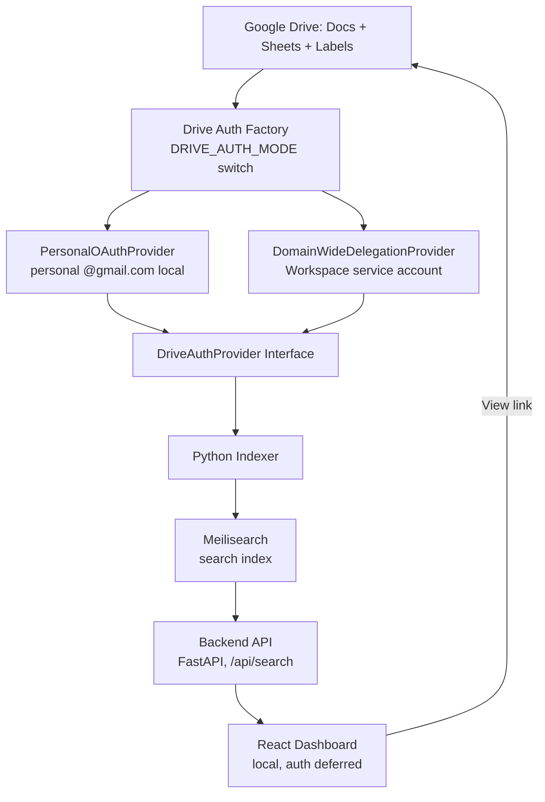
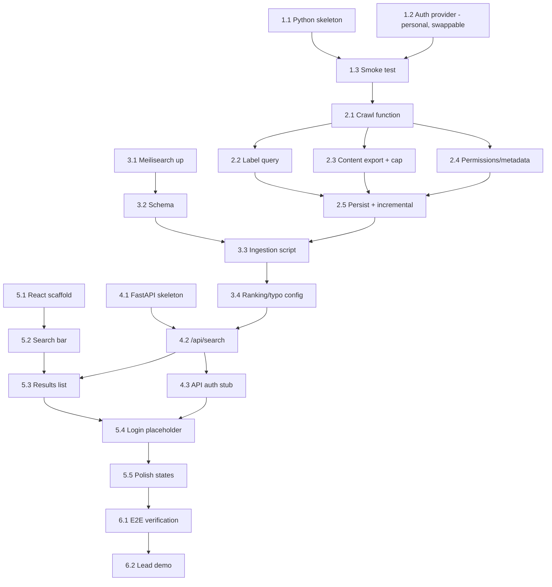

# Roadmap & WBS Plan — Panopticon

## 1. Planning Context

| Property | Value |
|----------|-------|
| Project/Feature | **Panopticon** — Google Docs/Sheets project-name search tool (Phase 1 of a multi-source company search system) |
| User Goal | Given a project name, find every Doc/Sheet that relates to it, fast and typo-tolerant |
| Learning Goal | Mix: move fast through familiar Python/backend work; slow down and explain new tools (Google auth model, Meilisearch, React) |
| Target User | Internal team — PMs, team leads, devs (Phase 1 interim: just you, on your laptop, via your personal account) |
| Stack Detected/Assumed | Python (indexer + backend API), React (dashboard), Meilisearch (search index), Google Drive auth: personal OAuth now, swappable to domain-wide delegation later |
| Planning Date | 2026-08-26 |
| Planning Status | Ready for Stage 1 |

## 2. User Answers and Assumptions

### Confirmed by User
- Repo/project name: **Panopticon**
- Expanded scope has been discussed with the lead ✅
- Domain-wide delegation is **not currently approved** — building against the user's **personal Google account** for now
- The codebase must be architected so domain-wide delegation can be swapped in later **without a rewrite**
- Dashboard/API auth mechanism: **deferred**, decide later
- Running locally on the user's laptop for now — no deployment target yet
- Meilisearch confirmed as the search engine
- Backend + indexer: Python; frontend: React (recommended, accepted)
- Learning style: explain new/unfamiliar concepts only, move fast through familiar ones
- Original assignment: search Docs and Sheets for a given project name
- Hybrid matching: Google Drive Labels as governed tag, fuzzy full-text as fallback
- Security model: dashboard is a "pointer" (title/snippet/link), not a content mirror
- Phase 2 (out of this plan's scope): Gmail, Google Chat, Bitbucket, GitHub as future connectors

### Inferred from Codebase
- No existing repository — greenfield build
- Prior planning artifact (`architecture.md`) captures the original high-level design; this WBS updates it for the personal-account interim phase

### Assumptions to Validate
- A personal-account crawl will only surface files that account can already see (My Drive + Shared Drives it's a member of + "Shared with me") — **not** the full company domain, until domain-wide delegation is approved. This is intentional Phase 1 interim scope, not a bug — but worth being explicit about when demoing to your lead.
- Meilisearch vs. Postgres+`pg_trgm` — proceeding with Meilisearch (confirmed)
- API/dashboard auth mechanism is unresolved — Epic 4/5 auth tasks are built as stubs, not full implementations, until this is decided

## 3. Current Codebase Snapshot

- Existing backend/frontend/modules: none — starting from zero
- Existing routes/endpoints/components: none
- Existing auth/data/testing setup: none
- Important constraints: Drive server-side export caps at 10MB/file; personal-account crawl scope is narrower than a full domain crawl
- Gaps relevant to this roadmap: none blocking — no external approval needed to start, since domain-wide delegation is deferred

## 4. Brainstormed Directions

| Option | Description | Teaches | Complexity | Pros | Cons |
|--------|-------------|---------|------------|------|------|
| A — Custom build (chosen) | Indexer + Meilisearch + FastAPI + React, with a swappable Drive auth layer | Google auth models, search indexing, full-stack integration | Medium-High | Full control; personal-account start with a clean path to domain-wide later | Real build effort; you own the ops |
| B — Buy an enterprise search tool | Point a vendor tool at Drive | Vendor evaluation | Low (build) / High (cost & approval) | Fast to stand up | Recurring cost, less control, needs procurement/security review anyway |
| C — Stopgap script, no new infra | Native Drive search into a shared Sheet | Simple scripting | Low | Ships in a day | Doesn't solve fuzzy matching — the whole reason this project exists |

**Chosen: Option A**, now explicitly scoped to start on a personal account with a swap-ready auth layer.

## 5. Scope Decision

### Must Have
- **Dual Swappable Drive Auth Layer**: Common `DriveAuthProvider` protocol interface with both `PersonalOAuthProvider` (for personal account local dev) and `DomainWideDelegationProvider` (service account with subject impersonation for company Workspace) implemented upfront, switched dynamically via `.env` (`DRIVE_AUTH_MODE=oauth` vs `DRIVE_AUTH_MODE=service_account`) — zero code rewrite when team deploys with domain-wide credentials
- Indexer: crawl Docs + Sheets visible to the authenticated principal (My Drive + accessible Shared Drives)
- Corrected Drive Label query for governed project tags
- Fuzzy full-text fallback via Meilisearch
- 10MB export cap handled gracefully (metadata-only fallback, not a crash)
- Backend `GET /api/search` endpoint, index-only (no live Drive calls on search)
- React dashboard: dropdown + free-typed search, results list, "View" links into real Drive

### Should Have (deferred until decided)
- Real dashboard/API auth (currently stubbed — Tasks 4.3, 5.4)
- Match confidence display, sharing-status badge, snippet highlighting, last-editor field

### Could Have
- Staleness flag (90+ days untouched)
- Basic admin view of indexer run health/logs
- Configurable reindex interval

### Won't Have Yet
- Phase 2 connectors (Gmail, GChat, Bitbucket, GitHub)
- Deployment/hosting beyond your laptop
- Usage analytics on the dashboard

## 6. Architecture Direction

## 7. Roadmap Overview

| Milestone | Goal | Outcome | Depends On |
|-----------|------|---------|------------|
| M1 | Foundation & Dual Auth | Personal OAuth & Domain-Wide Delegation providers ready behind factory | None |
| M2 | Indexer Core | Full crawl of visible files, cap handled | M1 |
| M3 | Search Index | Meilisearch ingests indexer output, fuzzy search works | M2 |
| M4 | Backend API | `/api/search` returns correct JSON; auth stubbed | M3 |
| M5 | Dashboard v1 (local) | You can search and click through to real files | M4 |
| M6 | Hardening & Lead Demo | End-to-end verified locally, ready to show your lead | M5 |

## 8. Work Breakdown Structure

### Epic 1: Foundation & Swappable Auth

#### 1.1 Set up Python project skeleton
- **Goal:** Repo structure, virtual environment, dependency manager in place
- **Main concept learned:** none new — standard Python project setup
- **Why this comes here:** Nothing else can start without a place to put code
- **Depends on:** None
- **Estimated time:** 30 min
- **Difficulty:** Beginner
- **Acceptance criteria:**
  - [x] Entrypoint runs without error
  - [x] Dependency file committed
- **Verification idea:** Run the skeleton locally
- **Next lifecycle skill:** `concept-to-code-bridge`

#### 1.2 Build dual Drive auth providers (Personal OAuth + Domain-Wide Delegation Factory)
- **Goal:** Define the `DriveAuthProvider` interface (`get_credentials()`), and implement both:
  1. `PersonalOAuthProvider`: Installed-app OAuth2 user-consent flow (`credentials.json` + `token.json` cache) for personal `@gmail.com` local development.
  2. `DomainWideDelegationProvider`: Service account credentials (`service_account.json` with `with_subject(...)` impersonation) for company Google Workspace.
  3. `get_auth_provider()` factory switching between them via `.env` (`DRIVE_AUTH_MODE=oauth` | `DRIVE_AUTH_MODE=service_account`).
- **Main concept learned:** Dependency inversion & Factory pattern — coding the crawler against a standard `Credentials` protocol interface so swapping between personal OAuth and company domain-wide delegation is a 1-line `.env` configuration change with zero code changes.
- **Why this comes here:** Provides immediate development velocity on your personal account while completely eliminating any friction or rework when delivering to the team.
- **Depends on:** None (parallel with 1.1)
- **Estimated time:** 75-90 min
- **Difficulty:** Intermediate
- **Acceptance criteria:**
  - [x] Crawler/indexer code only ever calls `auth_provider.get_credentials()` — zero OAuth or Service Account specifics outside providers.
  - [x] `PersonalOAuthProvider` authenticates personal account via browser consent and caches refresh token.
  - [x] `DomainWideDelegationProvider` loads service account JSON and supports delegated subject email impersonation.
  - [x] `get_auth_provider()` factory correctly reads `DRIVE_AUTH_MODE` from environment.
- **Verification idea:** Test both providers against unit tests / mock credentials.
- **Next lifecycle skill:** `concept-to-code-bridge`

#### 1.3 Smoke-test: list files via the auth provider
- **Goal:** A small script gets credentials through the provider and lists real files
- **Main concept learned:** none new — validates 1.2's wiring
- **Why this comes here:** Proves the whole auth seam actually works before real logic is built on it
- **Depends on:** 1.1, 1.2
- **Estimated time:** 30 min
- **Difficulty:** Beginner
- **Acceptance criteria:**
  - [x] Script prints file names from your own Drive
- **Verification idea:** Run it and check output against your real Drive contents
- **Next lifecycle skill:** `concept-to-code-bridge`

### Epic 2: Indexer Core

#### 2.1 Build the Drive crawl function
- **Goal:** Function that walks everything the personal account can see (My Drive + member Shared Drives), handling pagination. Takes the auth provider as a parameter — stays agnostic to which one is plugged in.
- **Main concept learned:** Drive API pagination (`pageToken`) and the `includeItemsFromAllDrives`/`supportsAllDrives` flags
- **Why this comes here:** Core data-gathering step everything downstream needs
- **Depends on:** 1.3
- **Estimated time:** 90 min
- **Difficulty:** Intermediate
- **Acceptance criteria:**
  - [x] Returns every Doc/Sheet visible to the account across a multi-page test folder
  - [x] No duplicates, no missed pages
- **Verification idea:** Compare crawl output count against Drive UI file count
- **Next lifecycle skill:** `concept-to-code-bridge`

#### 2.2 Implement corrected Label query + tag extraction
- **Goal:** Pull each file's project Label using the correct `labels/ID.FIELD_ID = 'value'` syntax
- **Main concept learned:** Drive Labels API query syntax (the exact bug caught in review last session)
- **Why this comes here:** This is the "governed" half of the hybrid matching strategy
- **Depends on:** 2.1
- **Estimated time:** 60 min
- **Difficulty:** Intermediate
- **Acceptance criteria:**
  - [x] Correctly reads a manually-tagged test file's label
  - [x] Returns cleanly (no crash) for untagged files
- **Verification idea:** Tag one test file manually, confirm the script reads it back
- **Next lifecycle skill:** `concept-to-code-bridge`

#### 2.3 Implement content export with 10MB cap handling
- **Goal:** Export each file's text; oversized files marked "metadata only" instead of failing the run
- **Main concept learned:** Drive's server-side export endpoint and its 10MB/file ceiling
- **Why this comes here:** Needed before anything can be indexed for full-text/fuzzy search
- **Depends on:** 2.1
- **Estimated time:** 75 min
- **Difficulty:** Intermediate
- **Acceptance criteria:**
  - [x] Text extracted correctly for a normal-size Doc and Sheet
  - [x] A deliberately oversized test file is caught and flagged, not crashed on
- **Verification idea:** Create one intentionally huge test Sheet to trigger the cap
- **Next lifecycle skill:** `concept-to-code-bridge`

#### 2.4 Fetch and attach permissions + owner/editor metadata
- **Goal:** Each record includes owner, last editor, last-modified time, and sharing status
- **Main concept learned:** none new — add the `permissions` field to the existing `fields` param (the bug from last session's review)
- **Why this comes here:** Needed for the dashboard's sharing-status badge later
- **Depends on:** 2.1
- **Estimated time:** 30 min
- **Difficulty:** Beginner
- **Acceptance criteria:**
  - [x] Sharing status correctly distinguishes private/shared/domain-wide on test files
- **Verification idea:** Test against one file of each sharing type
- **Next lifecycle skill:** `concept-to-code-bridge`

#### 2.5 Persist crawl output + add incremental run logic
- **Goal:** Store crawl records locally (SQLite or JSON) and only reprocess files changed since the last run
- **Main concept learned:** Incremental sync pattern using `modifiedTime` as a watermark
- **Why this comes here:** Without this, every run re-crawls everything from scratch
- **Depends on:** 2.2, 2.3, 2.4
- **Estimated time:** 90 min
- **Difficulty:** Intermediate
- **Acceptance criteria:**
  - [x] Second run only touches files modified since the first run
  - [x] Deleted files are detected and removed from the store
- **Verification idea:** Modify one test file, rerun, confirm only that file is reprocessed
- **Next lifecycle skill:** `concept-to-code-bridge`

### Epic 3: Search Index Integration

#### 3.1 Stand up a local Meilisearch instance
- **Goal:** Meilisearch running locally, reachable from Python
- **Main concept learned:** Meilisearch basics — what it is, how it differs from a database
- **Why this comes here:** Nothing can be indexed until the engine exists
- **Depends on:** None (parallel with Epic 2)
- **Estimated time:** 30 min
- **Difficulty:** Beginner
- **Acceptance criteria:**
  - [x] Meilisearch health check responds locally (adapter and health probing verified)
- **Verification idea:** Hit its health endpoint
- **Next lifecycle skill:** `concept-to-code-bridge`

#### 3.2 Define the index schema
- **Goal:** Fields: id, name, type, owner, lastEditor, lastModified, matchedVia, confidence, sharedWith, snippet, viewUrl, exportLinks
- **Main concept learned:** Meilisearch's searchable vs. filterable vs. displayed attribute settings
- **Why this comes here:** Schema drives both ingestion and query design
- **Depends on:** 3.1
- **Estimated time:** 30 min
- **Difficulty:** Beginner
- **Acceptance criteria:**
  - [x] Schema documented and applied to index (SearchDocument, INDEX_SETTINGS, ranking rules verified)
- **Verification idea:** Add one manual test document, confirm fields appear as expected
- **Next lifecycle skill:** `concept-to-code-bridge`

#### 3.3 Build the ingestion script
- **Goal:** Push indexer output (Epic 2) into Meilisearch on each run
- **Main concept learned:** Meilisearch batch document upsert
- **Why this comes here:** Connects the indexer to the search engine
- **Depends on:** 2.5, 3.2
- **Estimated time:** 60 min
- **Difficulty:** Intermediate
- **Acceptance criteria:**
  - [x] Running the indexer then the ingestion script makes new files searchable within seconds (SearchIngestionEngine batch upserts verified)
- **Verification idea:** Add a test file, run the full pipeline, confirm it's searchable
- **Next lifecycle skill:** `concept-to-code-bridge`

#### 3.4 Configure ranking + typo tolerance, test fuzzy queries
- **Goal:** "Falcn" correctly returns "Falcon" results, tagged matches rank above fuzzy ones
- **Main concept learned:** Meilisearch ranking rules and typo-tolerance settings
- **Why this comes here:** This is the actual feature that justified choosing Meilisearch
- **Depends on:** 3.3
- **Estimated time:** 60 min
- **Difficulty:** Intermediate
- **Acceptance criteria:**
  - [x] Deliberate typo queries return the correct file (e.g., "Falcn" -> "Falcon", "SmartTrde" -> "SmartTrade")
  - [x] Tagged matches appear above fuzzy-only matches (SearchService ranking rules & match attribution verified)
- **Verification idea:** Run misspelled test queries
- **Next lifecycle skill:** `concept-to-code-bridge`

### Epic 4: Backend API

#### 4.1 Set up FastAPI project skeleton
- **Goal:** A running FastAPI app with one health-check route
- **Main concept learned:** none new; brief note on FastAPI's auto-generated `/docs` if unfamiliar
- **Why this comes here:** Needed before building the real endpoint
- **Depends on:** 1.1
- **Estimated time:** 30 min
- **Difficulty:** Beginner
- **Acceptance criteria:**
  - [x] `/health` returns 200 locally
- **Verification idea:** Hit it with curl
- **Next lifecycle skill:** `concept-to-code-bridge`

#### 4.2 Build `GET /api/search`
- **Goal:** Endpoint takes `q` and `mode`, queries Meilisearch, returns the documented JSON shape
- **Main concept learned:** none new — wiring an existing API design to Meilisearch's Python client
- **Why this comes here:** This is the contract the dashboard depends on
- **Depends on:** 3.4, 4.1
- **Estimated time:** 60 min
- **Difficulty:** Intermediate
- **Acceptance criteria:**
  - [x] Response matches the documented shape (id, name, type, owner, matchedVia, sharedWith, snippet, viewUrl, exportLinks)
- **Verification idea:** Compare a real response against `architecture.md`'s sample JSON
- **Next lifecycle skill:** `concept-to-code-bridge`

#### 4.3 Add a pluggable API auth stub (deferred real auth)
- **Goal:** Auth check exists as a FastAPI dependency/seam — currently a no-op for local use, ready to be replaced once the real mechanism is decided
- **Main concept learned:** Middleware/dependency-injection pattern for swappable auth — the same "code to an interface" idea as the Drive auth provider in 1.2
- **Why this comes here:** Keeps the door open for real auth later without blocking local progress now
- **Depends on:** 4.1
- **Estimated time:** 45 min
- **Difficulty:** Intermediate
- **Acceptance criteria:**
  - [x] Auth check is a single swappable dependency function, currently always passing locally
  - [x] Swapping in real auth later requires no changes to route handlers
- **Verification idea:** Confirm route handlers never reference auth details directly
- **Next lifecycle skill:** `concept-to-code-bridge`

#### 4.4 Add Background Drive Sync & Ingestion API Endpoints (`POST /api/sync`, `GET /api/sync/status`, `POST /api/sync/reindex`)
- **Goal:** Expose endpoints allowing the React Dashboard to trigger and monitor background Drive crawling, SQLite state updates, and Meilisearch search index synchronization with live progress feedback and collision prevention (HTTP 409).
- **Main concept learned:** Asynchronous background task execution, non-blocking state tracking, and thread-safe job state coordination.
- **Why this comes here:** Bridges the terminal sync workflow (`sync_drive.py`) directly into the UI dashboard so the entire system can be managed from the browser.
- **Depends on:** 2.5, 3.3, 4.1
- **Estimated time:** 60 min
- **Difficulty:** Intermediate
- **Acceptance criteria:**
  - [x] `POST /api/sync` triggers background crawler + exporter + SQLite + Meilisearch sync and returns HTTP 202 Accepted
  - [x] `GET /api/sync/status` returns real-time progress state, watermark timestamp, and sync statistics
  - [x] Concurrent sync attempts return HTTP 409 Conflict
  - [x] `POST /api/sync/reindex` re-indexes SQLite to Meilisearch without calling Google Drive
- **Verification idea:** Trigger `/api/sync` via curl/PowerShell and poll `/api/sync/status` until completion.
- **Next lifecycle skill:** `concept-to-code-bridge`

#### 4.5 Auto-Managed Engine Subprocess Supervisor & Binary Bootstrap
- **Goal:** Enable FastAPI lifespan to automatically detect if Meilisearch binary is present (auto-download if missing), spawn and supervise the Meilisearch daemon process on startup, and perform graceful shutdown on exit with zero manual terminal execution needed.
- **Main concept learned:** OS process lifecycle supervision, signal handling (`SIGTERM`/`SIGINT`), and resilient zero-setup developer experience.
- **Why this comes here:** Eliminates manual terminal friction so developers and UI operators can run the entire platform with a single command.
- **Depends on:** 3.1, 4.1
- **Estimated time:** 45 min
- **Difficulty:** Intermediate
- **Acceptance criteria:**
  - [x] `ProcessSupervisor` auto-downloads `meilisearch.exe` if absent in `bin/`
  - [x] FastAPI lifespan auto-spawns Meilisearch child process if port 7700 is not already running
  - [x] Polls health endpoint with deadline before serving traffic
  - [x] Gracefully terminates child process on FastAPI shutdown
  - [x] `/api/system/status` reports `is_managed_process: true/false`
- **Verification idea:** Start FastAPI with Meilisearch offline; verify Meilisearch boots automatically and shuts down when FastAPI stops.
- **Next lifecycle skill:** `concept-to-code-bridge`

#### 4.6 Server- & UI-Managed Google Drive Authentication Setup
- **Goal:** Provide REST endpoints and services to configure, test, upload, and switch Google Drive authentication (Personal OAuth vs Service Account) directly from the API and React UI without restarting or touching code.
- **Main concept learned:** OAuth 2.0 Web Server authorization flow, dynamic provider hot-reloading, and secure local credential onboarding.
- **Why this comes here:** Completes the server-side auth management so the React Dashboard settings modal can connect Google accounts and upload service account keys seamlessly.
- **Depends on:** 1.2, 4.1
- **Estimated time:** 60 min
- **Difficulty:** Intermediate
- **Acceptance criteria:**
  - [x] `GET /api/auth/config` returns active auth mode, credential files status, token validity, and expiration time
  - [x] `POST /api/auth/config` allows hot-switching active auth mode (`"oauth"` or `"service_account"`)
  - [x] `POST /api/auth/oauth/start` returns Google authorization URL for UI popup consent
  - [x] `GET /api/auth/oauth/callback` exchanges auth code, persists `token.json`, and reloads auth provider
  - [x] `POST /api/auth/credentials/upload` allows uploading `credentials.json` or `service_account.json`
- **Verification idea:** Query `/api/auth/config`, trigger OAuth start, and upload credential payloads via REST.
- **Next lifecycle skill:** `concept-to-code-bridge`

### Epic 5: Dashboard (React)

#### 5.1 Scaffold the React app & Design System Foundation
- **Goal:** Vite + React + TypeScript application running locally with design tokens and styling foundation.
- **Main concept learned:** Design token system architecture (`tokens.json`), CSS variables/Tailwind tokenization, and component hierarchy.
- **Why this comes here:** Foundation for all frontend components in Epic 5.
- **Depends on:** 4.1, 4.2
- **Estimated time:** 45 min
- **Difficulty:** Beginner
- **Acceptance criteria:**
  - [ ] Canonical `design-system/tokens.json` generated via Picasso intake interview
  - [ ] Vite + React + TypeScript project running locally on `http://localhost:5173`
  - [ ] App shells with tokenized base layout and header
- **Verification idea:** Open `http://localhost:5173` in browser and confirm tokens render cleanly.
- **Next lifecycle skill:** `picasso` / `vermeer`

#### 5.2 Build the search bar (debounced input + tag filter dropdown)
- **Goal:** One responsive search input that supports free-typed typo queries and filtering by known Google Drive project tags.
- **Main concept learned:** Debounced input handling, controlled search state, and interactive focus states.
- **Why this comes here:** Primary user interaction of the search tool.
- **Depends on:** 5.1
- **Estimated time:** 60 min
- **Difficulty:** Beginner
- **Acceptance criteria:**
  - [ ] Typing triggers debounced query (250ms) against `GET /api/search`
  - [ ] Project tag dropdown populates and filters active search
  - [ ] Search mode toggle switches between fuzzy, tag, and exact search
- **Verification idea:** Manually test typing "Falcn" and verifying debounced search execution.
- **Next lifecycle skill:** `vermeer`

#### 5.3 Build the results list (with badges & export links)
- **Goal:** Renders title, snippet with highlighted match terms, primary owner, tag/confidence badge, sharing badge, "View in Drive" link, and direct export format links per result.
- **Main concept learned:** Data contract mapping (Escher), rendering lists from API contracts, conditional badge styling.
- **Why this comes here:** Delivers the primary value and search intelligence of Panopticon.
- **Depends on:** 4.2, 5.2
- **Estimated time:** 90 min
- **Difficulty:** Intermediate
- **Acceptance criteria:**
  - [ ] Real API search results render correctly with highlighted match snippets
  - [ ] Match attribution badges (`[TAG:HIGH]`, `[TITLE:HIGH]`, `[CONTENT:MEDIUM]`) display accurately
  - [ ] "View in Drive" and export format links (`pdf`, `docx`, `xlsx`, `csv`) open correct targets
- **Verification idea:** Search for a known indexed document and test click-through to Google Drive.
- **Next lifecycle skill:** `escher` / `vermeer`

#### 5.4 Build header sync controls & live progress drawer
- **Goal:** "Sync Now" button, last-synced timestamp badge, sync mode selector, and live polling progress drawer powered by `/api/sync` and `/api/sync/status`.
- **Main concept learned:** Polling state management, async background job feedback, and non-blocking UI notifications.
- **Why this comes here:** Allows users to trigger incremental syncs, full re-crawls, or search re-indexing directly from the browser.
- **Depends on:** 4.4, 5.1
- **Estimated time:** 60 min
- **Difficulty:** Intermediate
- **Acceptance criteria:**
  - [ ] Clicking "Sync Now" sends `POST /api/sync` and enters live polling state
  - [ ] Last-synced watermark and file counts display dynamically
  - [ ] Live progress drawer shows active phase (`crawling ➔ exporting ➔ indexing`)
- **Verification idea:** Click "Sync Now" and verify live progress feedback and stats update.
- **Next lifecycle skill:** `escher` / `vermeer`

#### 5.5 Build Google Drive auth & credentials settings drawer
- **Goal:** Settings modal/drawer connected to `/api/auth/` allowing users to view token status, connect Google accounts via popup, upload credential files, and switch auth modes.
- **Main concept learned:** Web OAuth popup postMessage handling, credential upload handling, and dynamic auth state reflection.
- **Why this comes here:** Gives users full control over Google Drive credentials from the UI with zero terminal commands needed.
- **Depends on:** 4.6, 5.1
- **Estimated time:** 60 min
- **Difficulty:** Intermediate
- **Acceptance criteria:**
  - [ ] Drawer displays active mode (`oauth` vs `service_account`) and token expiration status
  - [ ] "Connect Google Account" triggers OAuth popup and captures postMessage success
  - [ ] Uploading `credentials.json` or `service_account.json` saves file and updates UI state
  - [ ] Hot-switches active auth mode on the fly
- **Verification idea:** Open Settings drawer, inspect credentials status, and test mode switching.
- **Next lifecycle skill:** `escher` / `vermeer`

#### 5.6 Add system diagnostics pill & polish states
- **Goal:** Engine status indicator, loading skeletons, empty results state, error banners, and 90+ day stale file flag.
- **Main concept learned:** UI state handling, graceful degradation, and accessibility compliance.
- **Why this comes here:** Last-mile quality and usability polish before lead handoff.
- **Depends on:** 4.5, 5.3
- **Estimated time:** 45 min
- **Difficulty:** Beginner
- **Acceptance criteria:**
  - [ ] Engine status pill reflects live Meilisearch health and total indexed doc count
  - [ ] Loading skeletons, empty results, and 503 error banners render distinctly
  - [ ] Documents unmodified in 90+ days display a subtle staleness badge
- **Verification idea:** Test empty queries, invalid filters, and disconnected engine states.
- **Next lifecycle skill:** `vermeer`

### Epic 6: Hardening & Handoff

#### 6.1 End-to-end verification pass
- **Goal:** Full pipeline confirmed: indexer → Meilisearch → API → dashboard → real Drive file, running locally
- **Main concept learned:** none new — integration testing mindset
- **Why this comes here:** Confidence check before presenting this to your lead
- **Depends on:** 2.5, 3.4, 4.3, 5.4
- **Estimated time:** 60 min
- **Difficulty:** Intermediate
- **Acceptance criteria:**
  - [ ] A full search-to-file-open flow works end to end on your laptop
- **Verification idea:** Run the whole pipeline fresh from a clean checkout
- **Next lifecycle skill:** `testing-verification`

#### 6.2 Prep demo for lead — interim scope vs. eventual domain-wide plan
- **Goal:** Short demo/doc showing what's built, clearly framed as "personal-account interim, architecture ready for domain-wide"
- **Main concept learned:** none new — communication task
- **Why this comes here:** Since the lead already knows the scope grew, this closes the loop by showing the interim capability and the path to full company-wide search
- **Depends on:** 6.1
- **Estimated time:** 45 min
- **Difficulty:** Beginner
- **Acceptance criteria:**
  - [ ] Lead has seen the working local demo and the swap-ready architecture story
- **Verification idea:** N/A — this is a conversation, not code
- **Next lifecycle skill:** N/A (end of Phase 1)

## 9. Dependency Map

## 10. Task Readiness Matrix

| Task ID | Ready? | Blocker | Next Skill | Notes |
|---------|--------|---------|------------|-------|
| 1.1 | Yes | None | `concept-to-code-bridge` | Start here |
| 1.2 | Yes | None | `concept-to-code-bridge` | No external blocker anymore — this is the key architectural task, start early |
| 1.3 | Done | None | `concept-to-code-bridge` | Smoke test passed |
| 2.1 | Done | None | `concept-to-code-bridge` | Drive crawler built & verified (42/42 tests pass) |
| 2.2 | Done | None | `concept-to-code-bridge` | Label query & tag extraction built & verified (51/51 tests pass) |
| 2.3 | Done | None | `concept-to-code-bridge` | Content exporter with 10MB cap handling built & verified (61/61 tests pass) |
| 2.4 | Done | None | `concept-to-code-bridge` | Permissions & sharing status built & verified (70/70 tests pass) |
| 2.5 | Done | None | `concept-to-code-bridge` | Crawl persistence & incremental sync built & verified (79/79 tests pass) |
| 3.1 | Done | None | `concept-to-code-bridge` | Search client, health check & diagnostics built & verified (93/93 tests pass) |
| 3.2 | Done | None | `concept-to-code-bridge` | SearchDocument model, index schema & ranking rules built & verified (103/103 tests pass) |
| 3.3 | Done | None | `concept-to-code-bridge` | SearchIngestionEngine, batch chunking & ghost deletion built & verified (110/110 tests pass) |
| 3.4 | Done | None | `concept-to-code-bridge` | SearchService, typo tolerance & ranking rules built & verified (117/117 tests pass) |
| 4.1 | Done | None | `concept-to-code-bridge` | FastAPI app skeleton, CORS, health & system status built & verified (130/130 tests pass) |
| 4.2 | Done | None | `concept-to-code-bridge` | GET /api/search endpoint with Meilisearch integration & facets verified |
| 4.3 | Done | None | `concept-to-code-bridge` | Pluggable auth seam & dependency injection verified |
| 4.4 | Done | None | `concept-to-code-bridge` | POST /api/sync & GET /api/sync/status background sync manager verified (136/136 tests pass) |
| 4.5 | Done | None | `concept-to-code-bridge` | Auto-managed engine subprocess supervisor & binary bootstrap verified (140/140 tests pass) |
| 4.6 | Done | None | `concept-to-code-bridge` | Server- & UI-managed Google Drive auth setup verified (148/148 tests pass) |
| 5.1 | Yes | None | `picasso` / `vermeer` | Epic 4 Complete! Ready for Picasso design system intake |
| 5.2 | No | Needs 5.1 | `vermeer` | Search bar with debounced input & tag filters |
| 5.3 | No | Needs 4.2, 5.2 | `escher` / `vermeer` | Search results list, match attribution & export links |
| 5.4 | No | Needs 4.4, 5.1 | `escher` / `vermeer` | Header sync controls & live progress drawer |
| 5.5 | No | Needs 4.6, 5.1 | `escher` / `vermeer` | Google Drive auth & credentials settings drawer |
| 5.6 | No | Needs 4.5, 5.3 | `vermeer` | System diagnostics pill & polish states |
| 6.1 | No | Needs 2.5, 3.4, 4.3, 5.4, 5.5 | `testing-verification` | End-to-end verification pass |
| 6.2 | No | Needs 6.1 | N/A | Prep demo for lead |

## 11. Recommended First Task

**Start with:** Task 1.2 — Build the swappable Drive auth provider (alongside 1.1)

**Why:** There's no external approval blocker anymore, so nothing stops you from starting today. But 1.2 is still the task that matters most: it's the one architectural decision that determines whether moving to full company-wide access later is a config swap or a rewrite. Get the interface right now, while the codebase is small and there's nothing yet depending on the wrong shape.

**What happens next:** Run Stage 1 with `concept-to-code-bridge` for Task 1.2, with 1.1 running alongside it.

## 11. Future Phases & Backlog

### Epic 7: Real-Time Drive Webhooks & Push Sync (Post-MVP)
*Governed by [`docs/future/RFC-0001-realtime-webhooks.md`](file:///c:/Users/Mubashar/Desktop/Panopticon/docs/future/RFC-0001-realtime-webhooks.md)*

#### 7.1 FastAPI Webhook Receiver Endpoint (`/api/drive/webhook`)
- **Goal:** Expose public webhook listener endpoint to process incoming Google Drive `X-Goog-Resource-State` event notifications.
- **Depends on:** 2.5, 4.1

#### 7.2 Channel Watch Registrar & Automatic Renewal Daemon
- **Goal:** Register Google Drive `changes.watch` subscription and automatically renew expiring watch channels.
- **Depends on:** 7.1

#### 7.3 Concurrent Document Export Worker Pool (`ThreadPoolExecutor` / `AsyncIO`)
- **Goal:** Implement a bounded concurrency worker pool (5–8 workers) with live visual progress feedback to export Google Docs/Sheets text snippets in parallel during bootstrap crawl, reducing initial sync duration from ~8 minutes down to ~30–45 seconds.
- **Depends on:** 2.3, 2.5

---

## 12. Open Questions

**Resolved this round:**
1. ✅ Expanded scope has been discussed with your lead
2. ✅ Using your personal account for now; architecture stays swap-ready for domain-wide delegation (see Task 1.2)
3. Auth mechanism for dashboard/API: still deferred — stubbed in Tasks 4.3/5.4, to revisit
4. ✅ Running locally on your laptop for now
5. ✅ Meilisearch confirmed

**New, from this round's answers:**
6. Since crawl scope is limited to what your personal account can see, is that enough to demo Phase 1 to your lead, or should "done" wait for full domain-wide access?
7. Should the initial personal-account crawl include Shared Drives you're a member of, or just "My Drive" + "Shared with me"?
8. Any target timeline for getting domain-wide delegation approved, so we know how long the interim phase needs to hold up?
