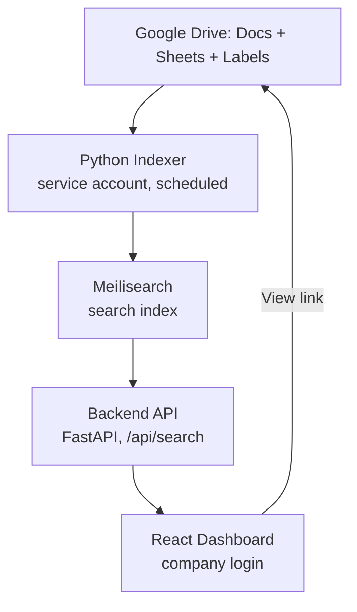
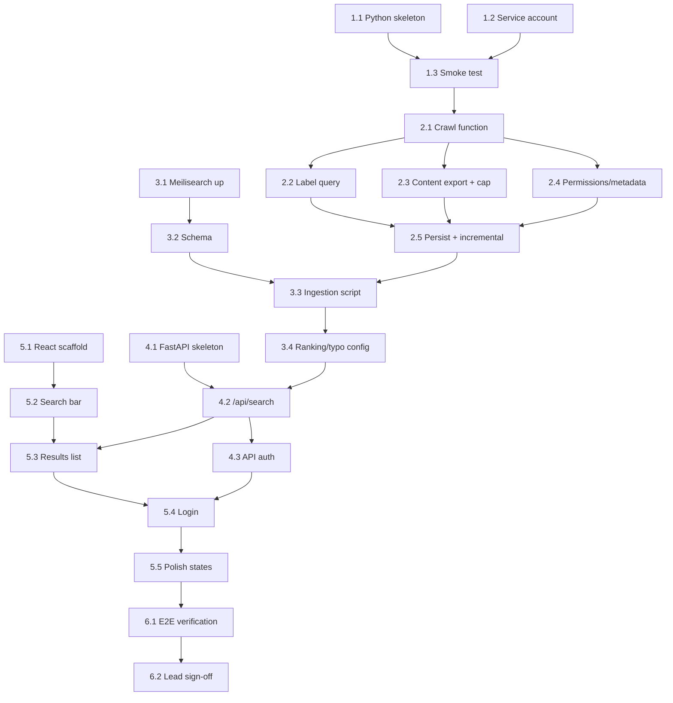

# Roadmap & WBS Plan — Company Doc Search Tool

## 1. Planning Context

| Property | Value |
|----------|-------|
| Project/Feature | Google Docs/Sheets project-name search tool (Phase 1 of a multi-source company search system) |
| User Goal | Given a project name, find every Doc/Sheet that relates to it, fast and typo-tolerant, across the whole company Drive |
| Learning Goal | Mix: move fast through familiar Python/backend work; slow down and explain new tools (Google Drive API auth model, Meilisearch, React) |
| Target User | Internal team — PMs, team leads, devs — logged in with company Google account |
| Stack Detected/Assumed | Python (indexer + backend API), React (dashboard, recommended), Meilisearch (search index) |
| Planning Date | 2026-08-26 |
| Planning Status | Ready for Stage 1 |

## 2. User Answers and Assumptions

### Confirmed by User
- Backend + indexer will be built in Python
- Learning style: explain new/unfamiliar concepts only, move fast through familiar ones
- Frontend framework left open — recommendation requested
- Original assignment: search Docs and Sheets for a given project name
- Scope was expanded (by prior design work) into: background indexer → Meilisearch search index → backend API → dashboard
- Hybrid matching: Google Drive Labels as governed tag, fuzzy full-text as fallback
- Security model: dashboard is a "pointer" (title/snippet/link), not a content mirror — clicking through respects Drive's real permissions
- Phase 2 (not in this plan's scope): Gmail, Google Chat, Bitbucket, GitHub as future connectors

### Inferred from Codebase
- No existing repository — this is a greenfield build
- One prior planning artifact exists (`architecture.md`) capturing the high-level design; this WBS operationalizes it

### Assumptions to Validate
- Meilisearch vs. Postgres+`pg_trgm` — proceeding with Meilisearch; revisit only if hosting/infra constraints make a new service impractical
- Company Google login/OAuth mechanism for the dashboard is not yet designed
- Deployment target (local dev box, internal server, cloud) is unknown — assuming local/dev-first for now
- Expanded scope has **not** been signed off by your lead yet — flagged as a real risk, not just a formality

## 3. Current Codebase Snapshot

- Existing backend/frontend/modules: none — starting from zero
- Existing routes/endpoints/components: none
- Existing auth/data/testing setup: none
- Important constraints: must use a domain-wide Google service account (high blast-radius credential); Drive server-side export caps at 10MB/file
- Gaps relevant to this roadmap: no confirmed Google Workspace admin access yet for domain-wide delegation — likely the single biggest schedule risk

## 4. Brainstormed Directions

| Option | Description | Teaches | Complexity | Pros | Cons |
|--------|-------------|---------|------------|------|------|
| A — Custom build (chosen) | Indexer + Meilisearch + FastAPI + React, per the architecture doc | Google Drive API, search indexing, full-stack integration | Medium-High | Full control over matching/security model; reusable for Phase 2 connectors | Real build effort; you own the ops |
| B — Buy an enterprise search tool (e.g. Glean-style) | Point a vendor tool at company Drive | Vendor evaluation, integration config | Low (build) / High (cost & approval) | Fast to stand up, less code to maintain | Recurring cost, less control over the "pointer not mirror" security model, likely needs procurement/security review |
| C — Stopgap script, no new infra | A scheduled script that writes matches into a shared Sheet, using Drive's native search (no fuzzy matching) | Google Apps Script or a simple Python cron job | Low | Ships in a day, zero new services | Doesn't solve the fuzzy-match problem that motivated this whole project; a dead end, not a foundation |

**Chosen: Option A.** It's the only option that actually solves the fuzzy-matching problem and sets up Phase 2 cleanly, and you've already validated the design against Google's real API docs.

## 5. Scope Decision

### Must Have
- Indexer: crawl Docs + Sheets (My Drive + Shared Drives) via domain-wide service account
- Corrected Drive Label query for governed project tags
- Fuzzy full-text fallback via Meilisearch
- 10MB export cap handled gracefully (metadata-only fallback, not a crash)
- Backend `GET /api/search` endpoint, index-only (no live Drive calls on search)
- React dashboard: dropdown + free-typed search, results list, "View" links into real Drive (permissions enforced by Drive)

### Should Have
- Match confidence display (tagged vs. fuzzy %)
- Sharing-status badge per result
- Snippet highlighting
- Last-editor field

### Could Have
- Staleness flag (90+ days untouched)
- Basic admin view of indexer run health/logs
- Configurable reindex interval

### Won't Have Yet
- Phase 2 connectors (Gmail, GChat, Bitbucket, GitHub)
- Any feature that stores full document content in the dashboard/index beyond snippets
- Usage analytics on the dashboard

## 6. Architecture Direction

## 7. Roadmap Overview

| Milestone | Goal | Outcome | Depends On |
|-----------|------|---------|------------|
| M1 | Foundation & Auth | Service account working, can list files via Drive API | None |
| M2 | Indexer Core | Full crawl produces clean records for every Doc/Sheet, cap handled | M1 |
| M3 | Search Index | Meilisearch ingests indexer output, fuzzy search works | M2 |
| M4 | Backend API | `/api/search` returns correct, complete JSON from the index | M3 |
| M5 | Dashboard v1 | Team can search and click through to real files | M4 |
| M6 | Hardening & Handoff | End-to-end verified, ready to show your lead for scope sign-off | M5 |

## 8. Work Breakdown Structure

### Epic 1: Foundation & Auth

#### 1.1 Set up Python project skeleton
- **Goal:** Repo structure, virtual environment, dependency manager (uv or poetry) in place
- **Main concept learned:** none new — standard Python project setup
- **Why this comes here:** Nothing else can start without a place to put code
- **Depends on:** None
- **Estimated time:** 30 min
- **Difficulty:** Beginner
- **Acceptance criteria:**
  - [ ] `python -m project` runs without error
  - [ ] Dependency file committed
- **Verification idea:** Run the skeleton entrypoint locally
- **Next lifecycle skill:** `concept-to-code-bridge`

#### 1.2 Create Google Cloud service account with domain-wide delegation
- **Goal:** A service account exists and is authorized to impersonate users for Drive API access
- **Main concept learned:** Google's domain-wide delegation model — why a service account needs explicit Workspace-admin approval to act "as" any user, and why this credential is high blast-radius
- **Why this comes here:** This is the riskiest external dependency in the whole project — it needs Workspace admin involvement, which can have its own approval lead time
- **Depends on:** None (can run in parallel with 1.1)
- **Estimated time:** 60-90 min (plus admin wait time, which is out of your control)
- **Difficulty:** Intermediate
- **Acceptance criteria:**
  - [ ] Service account created in Google Cloud Console
  - [ ] Domain-wide delegation approved in Workspace Admin Console
  - [ ] Correct scope (`drive.readonly`) granted
- **Verification idea:** Credentials file downloads successfully; scope visible in Admin Console
- **Next lifecycle skill:** `concept-to-code-bridge`

#### 1.3 Smoke-test: list files via the service account
- **Goal:** A small script authenticates and lists a handful of real Drive files
- **Main concept learned:** Google API client auth flow in Python (`google-auth`, impersonation)
- **Why this comes here:** Proves the credential actually works before any real logic is built on top of it
- **Depends on:** 1.1, 1.2
- **Estimated time:** 45 min
- **Difficulty:** Intermediate
- **Acceptance criteria:**
  - [ ] Script prints file names from at least one Shared Drive
  - [ ] Auth errors are caught and logged clearly
- **Verification idea:** Run against a real (non-production-sensitive) test folder first
- **Next lifecycle skill:** `concept-to-code-bridge`

### Epic 2: Indexer Core

#### 2.1 Build the Drive crawl function
- **Goal:** Function that walks My Drive + all Shared Drives, handling pagination
- **Main concept learned:** Drive API pagination (`pageToken`) and `includeItemsFromAllDrives`/`supportsAllDrives` flags
- **Why this comes here:** Core data-gathering step everything downstream needs
- **Depends on:** 1.3
- **Estimated time:** 90 min
- **Difficulty:** Intermediate
- **Acceptance criteria:**
  - [ ] Returns every Doc/Sheet across a multi-page test Drive
  - [ ] No duplicates, no missed pages
- **Verification idea:** Compare crawl output count against Drive UI file count for a test folder
- **Next lifecycle skill:** `concept-to-code-bridge`

#### 2.2 Implement corrected Label query + tag extraction
- **Goal:** Pull each file's project Label (if any) using the correct `labels/ID.FIELD_ID = 'value'` syntax
- **Main concept learned:** Drive Labels API query syntax (the exact bug caught in review last session)
- **Why this comes here:** This is the "governed" half of the hybrid matching strategy
- **Depends on:** 2.1
- **Estimated time:** 60 min
- **Difficulty:** Intermediate
- **Acceptance criteria:**
  - [ ] Correctly reads label value from a manually-tagged test file
  - [ ] Returns `None`/empty cleanly for untagged files (no crash)
- **Verification idea:** Tag one test file manually in Drive, confirm the script reads it back
- **Next lifecycle skill:** `concept-to-code-bridge`

#### 2.3 Implement content export with 10MB cap handling
- **Goal:** Export each file's text content; oversized files get marked "metadata only" instead of failing the run
- **Main concept learned:** Drive's server-side export endpoint and its 10MB/file ceiling
- **Why this comes here:** Needed before anything can be indexed for full-text/fuzzy search
- **Depends on:** 2.1
- **Estimated time:** 75 min
- **Difficulty:** Intermediate
- **Acceptance criteria:**
  - [ ] Text extracted correctly for a normal-size Doc and Sheet
  - [ ] A deliberately oversized test file is caught and flagged, not crashed on
- **Verification idea:** Create one intentionally huge test Sheet to trigger the cap
- **Next lifecycle skill:** `concept-to-code-bridge`

#### 2.4 Fetch and attach permissions + owner/editor metadata
- **Goal:** Each record includes owner, last editor, last-modified time, and sharing status
- **Main concept learned:** none new — just adding the `permissions` field to the existing `fields` param (the bug from last session's review)
- **Why this comes here:** Needed for the dashboard's sharing-status badge later
- **Depends on:** 2.1
- **Estimated time:** 30 min
- **Difficulty:** Beginner
- **Acceptance criteria:**
  - [ ] Sharing status correctly distinguishes private/shared/domain-wide on test files
- **Verification idea:** Test against one file of each sharing type
- **Next lifecycle skill:** `concept-to-code-bridge`

#### 2.5 Persist crawl output + add incremental run logic
- **Goal:** Store crawl records locally (e.g. SQLite or JSON) and only reprocess files changed since the last run
- **Main concept learned:** Incremental sync pattern using `modifiedTime` as a watermark
- **Why this comes here:** Without this, every scheduled run re-crawls the entire company Drive from scratch
- **Depends on:** 2.2, 2.3, 2.4
- **Estimated time:** 90 min
- **Difficulty:** Intermediate
- **Acceptance criteria:**
  - [ ] Second run only touches files modified since the first run
  - [ ] Deleted files are detected and removed from the store
- **Verification idea:** Modify one test file, rerun, confirm only that file is reprocessed
- **Next lifecycle skill:** `concept-to-code-bridge`

### Epic 3: Search Index Integration

#### 3.1 Stand up a local Meilisearch instance
- **Goal:** Meilisearch running locally, reachable from Python
- **Main concept learned:** Meilisearch basics — what it is, how it differs from a database
- **Why this comes here:** Nothing can be indexed until the engine exists
- **Depends on:** None (can run in parallel with Epic 2)
- **Estimated time:** 30 min
- **Difficulty:** Beginner
- **Acceptance criteria:**
  - [ ] Meilisearch health check responds locally
- **Verification idea:** Hit its health endpoint from a browser or curl
- **Next lifecycle skill:** `concept-to-code-bridge`

#### 3.2 Define the index schema
- **Goal:** Fields decided: id, name, type, owner, lastEditor, lastModified, matchedVia, confidence, sharedWith, snippet, viewUrl, exportLinks
- **Main concept learned:** Meilisearch's searchable vs. filterable vs. displayed attribute settings
- **Why this comes here:** Schema drives both ingestion and query design
- **Depends on:** 3.1
- **Estimated time:** 30 min
- **Difficulty:** Beginner
- **Acceptance criteria:**
  - [ ] Schema documented and applied to a test index
- **Verification idea:** Add one manual test document, confirm fields appear as expected
- **Next lifecycle skill:** `concept-to-code-bridge`

#### 3.3 Build the ingestion script
- **Goal:** Push indexer output (Epic 2) into Meilisearch on each run
- **Main concept learned:** Meilisearch batch document upsert
- **Why this comes here:** Connects the indexer to the search engine
- **Depends on:** 2.5, 3.2
- **Estimated time:** 60 min
- **Difficulty:** Intermediate
- **Acceptance criteria:**
  - [ ] Running the indexer, then the ingestion script, makes new files searchable within seconds
- **Verification idea:** Add a test file in Drive, run the full pipeline, confirm it's searchable
- **Next lifecycle skill:** `concept-to-code-bridge`

#### 3.4 Configure ranking + typo tolerance, test fuzzy queries
- **Goal:** "Falcn" correctly returns "Falcon" results, tagged matches rank above fuzzy ones
- **Main concept learned:** Meilisearch ranking rules and typo-tolerance settings
- **Why this comes here:** This is the actual feature that justified choosing Meilisearch in the first place
- **Depends on:** 3.3
- **Estimated time:** 60 min
- **Difficulty:** Intermediate
- **Acceptance criteria:**
  - [ ] Deliberate typo queries return the correct file
  - [ ] Tagged/governed matches appear above fuzzy-only matches
- **Verification idea:** Run a handful of misspelled test queries
- **Next lifecycle skill:** `concept-to-code-bridge`

### Epic 4: Backend API

#### 4.1 Set up FastAPI project skeleton
- **Goal:** A running FastAPI app with one health-check route
- **Main concept learned:** none new if you know Python web basics; brief note on FastAPI's automatic docs (`/docs`) if unfamiliar
- **Why this comes here:** Needed before building the real endpoint
- **Depends on:** 1.1
- **Estimated time:** 30 min
- **Difficulty:** Beginner
- **Acceptance criteria:**
  - [ ] `/health` returns 200 locally
- **Verification idea:** Hit it with curl
- **Next lifecycle skill:** `concept-to-code-bridge`

#### 4.2 Build `GET /api/search`
- **Goal:** Endpoint takes `q` and `mode`, queries Meilisearch, returns the JSON shape from the architecture doc
- **Main concept learned:** none new — wiring an existing API design to Meilisearch's Python client
- **Why this comes here:** This is the contract the dashboard will depend on
- **Depends on:** 3.4, 4.1
- **Estimated time:** 60 min
- **Difficulty:** Intermediate
- **Acceptance criteria:**
  - [ ] Response matches the documented shape exactly (id, name, type, owner, matchedVia, sharedWith, snippet, viewUrl, exportLinks)
- **Verification idea:** Compare a real response against the sample JSON in `architecture.md`
- **Next lifecycle skill:** `concept-to-code-bridge`

#### 4.3 Add company-login auth check to the API
- **Goal:** Endpoint rejects requests without a valid company session/token
- **Main concept learned:** Basic OAuth/session verification pattern in FastAPI (exact provider TBD — see Open Questions)
- **Why this comes here:** "Open to the whole team" still needs to mean "not open to the whole internet"
- **Depends on:** 4.1
- **Estimated time:** 90 min (depends on chosen auth approach — treat as an estimate, not a commitment)
- **Difficulty:** Intermediate
- **Acceptance criteria:**
  - [ ] Unauthenticated request is rejected
  - [ ] Authenticated request succeeds
- **Verification idea:** Test both cases manually
- **Next lifecycle skill:** `concept-to-code-bridge`

### Epic 5: Dashboard (React)

#### 5.1 Scaffold the React app
- **Goal:** Vite + React project running locally with a blank layout
- **Main concept learned:** React project structure basics (components, props, `useState`)
- **Why this comes here:** Foundation for every UI task below
- **Depends on:** None (can start in parallel with Epics 2-4)
- **Estimated time:** 30 min
- **Difficulty:** Beginner
- **Acceptance criteria:**
  - [ ] Blank app runs at `localhost`
- **Verification idea:** Open it in a browser
- **Next lifecycle skill:** `concept-to-code-bridge`

#### 5.2 Build the search bar (dropdown + free-typed)
- **Goal:** One input that supports picking a known project or typing any name
- **Main concept learned:** Controlled inputs in React, conditional rendering
- **Why this comes here:** Primary interaction of the whole tool
- **Depends on:** 5.1
- **Estimated time:** 60 min
- **Difficulty:** Beginner
- **Acceptance criteria:**
  - [ ] Typing and selecting both produce a query value
- **Verification idea:** Manually test both input modes
- **Next lifecycle skill:** `concept-to-code-bridge`

#### 5.3 Build the results list (with badges)
- **Goal:** Renders title, snippet, owner, tag/confidence badge, sharing badge, "View" link per result
- **Main concept learned:** Rendering lists from API data (`.map()`), conditional badge styling
- **Why this comes here:** This is the actual value delivery of the dashboard
- **Depends on:** 4.2, 5.2
- **Estimated time:** 90 min
- **Difficulty:** Intermediate
- **Acceptance criteria:**
  - [ ] Real API results render correctly for a known test query
  - [ ] "View" link opens the real Drive file
- **Verification idea:** Search for a real tagged test project end-to-end
- **Next lifecycle skill:** `concept-to-code-bridge`

#### 5.4 Wire company login
- **Goal:** User must log in with their company Google account before searching
- **Main concept learned:** OAuth login flow from the frontend side (matches 4.3's backend piece)
- **Why this comes here:** Completes the "team-only" access model
- **Depends on:** 4.3, 5.1
- **Estimated time:** 90 min
- **Difficulty:** Intermediate
- **Acceptance criteria:**
  - [ ] Logged-out users see a login prompt, not the search UI
- **Verification idea:** Test logged-in and logged-out states
- **Next lifecycle skill:** `concept-to-code-bridge`

#### 5.5 Polish states: loading, empty, error, staleness flag
- **Goal:** Dashboard feels finished, not just functional
- **Main concept learned:** none new — UI state handling
- **Why this comes here:** Last-mile quality before showing this to your lead
- **Depends on:** 5.3
- **Estimated time:** 60 min
- **Difficulty:** Beginner
- **Acceptance criteria:**
  - [ ] Loading, empty-results, and error states all render distinctly
  - [ ] Files untouched 90+ days show a staleness flag
- **Verification idea:** Force each state manually (disconnect API, search nonsense, etc.)
- **Next lifecycle skill:** `concept-to-code-bridge`

### Epic 6: Hardening & Handoff

#### 6.1 End-to-end verification pass
- **Goal:** Full pipeline confirmed: indexer → Meilisearch → API → dashboard → real Drive file, with permissions enforced
- **Main concept learned:** none new — integration testing mindset
- **Why this comes here:** Confidence check before presenting this to your lead
- **Depends on:** 2.5, 3.4, 4.3, 5.4
- **Estimated time:** 60 min
- **Difficulty:** Intermediate
- **Acceptance criteria:**
  - [ ] A user without access to a test file cannot open it via the dashboard link, even though it appears in search
- **Verification idea:** Test with two accounts of different permission levels
- **Next lifecycle skill:** `testing-verification`

#### 6.2 Prep scope summary for lead sign-off
- **Goal:** Short doc/demo showing what was built vs. the original two-line ask, ready to present
- **Main concept learned:** none new — this is a communication task, not a technical one
- **Why this comes here:** The scope grew well past the original assignment; this closes that open loop before going further (e.g. into Phase 2)
- **Depends on:** 6.1
- **Estimated time:** 45 min
- **Difficulty:** Beginner
- **Acceptance criteria:**
  - [ ] Lead has seen and responded to the expanded scope
- **Verification idea:** N/A — this is a conversation, not code
- **Next lifecycle skill:** N/A (end of Phase 1)

## 9. Dependency Map

## 10. Task Readiness Matrix

| Task ID | Ready? | Blocker | Next Skill | Notes |
|---------|--------|---------|------------|-------|
| 1.1 | Yes | None | `concept-to-code-bridge` | Start here |
| 1.2 | Yes | None (may need Workspace admin) | `concept-to-code-bridge` | Kick off in parallel — likely the real timeline risk |
| 1.3 | No | Needs 1.1, 1.2 | `concept-to-code-bridge` | |
| 2.1 | No | Needs 1.3 | `concept-to-code-bridge` | |
| 2.2-2.4 | No | Needs 2.1 | `concept-to-code-bridge` | Can be done in any order once 2.1 is done |
| 2.5 | No | Needs 2.2, 2.3, 2.4 | `concept-to-code-bridge` | |
| 3.1 | Yes | None | `concept-to-code-bridge` | Can start immediately, in parallel with Epic 2 |
| 3.2 | No | Needs 3.1 | `concept-to-code-bridge` | |
| 3.3 | No | Needs 2.5, 3.2 | `concept-to-code-bridge` | |
| 3.4 | No | Needs 3.3 | `concept-to-code-bridge` | |
| 4.1 | Yes | None | `concept-to-code-bridge` | Can start immediately |
| 4.2 | No | Needs 3.4, 4.1 | `concept-to-code-bridge` | |
| 4.3 | No | Needs 4.1; auth approach undecided | `concept-to-code-bridge` | See Open Questions |
| 5.1 | Yes | None | `concept-to-code-bridge` | Can start immediately |
| 5.2 | No | Needs 5.1 | `concept-to-code-bridge` | |
| 5.3 | No | Needs 4.2, 5.2 | `concept-to-code-bridge` | |
| 5.4 | No | Needs 4.3, 5.1 | `concept-to-code-bridge` | |
| 5.5 | No | Needs 5.3 | `concept-to-code-bridge` | |
| 6.1 | No | Needs 2.5, 3.4, 4.3, 5.4 | `testing-verification` | |
| 6.2 | No | Needs 6.1 | N/A | |

## 11. Recommended First Task

**Start with:** Task 1.2 — Create Google Cloud service account with domain-wide delegation (run alongside 1.1)

**Why:** Everything else in this plan assumes the service account works. It's also the one task in the whole roadmap that depends on someone outside you — a Workspace admin approving domain-wide delegation — which can introduce a real, unpredictable delay if it's not started early. Task 1.1 (project skeleton) is trivial and can run in parallel while you wait on that approval, so there's no reason to sit idle.

**What happens next:** Run Stage 1 with `concept-to-code-bridge` for Task 1.2, and kick off 1.1 alongside it.

## 12. Open Questions

1. Has the expanded scope (indexer + search index + dashboard, vs. the original "search Docs/Sheets" ask) actually been discussed with your lead yet?
2. Who has Google Workspace admin access to approve domain-wide delegation, and how long does that typically take at your company?
3. What auth mechanism should the dashboard/API use for "company login" — Google OAuth directly, an existing internal SSO, something else?
4. Where will this actually run once built — a laptop for now, an internal server, a cloud account? This affects how much to invest in deployment tasks in Epic 6.
5. Is Meilisearch an approved new service to run, or does infra/security need to sign off on adding it?
